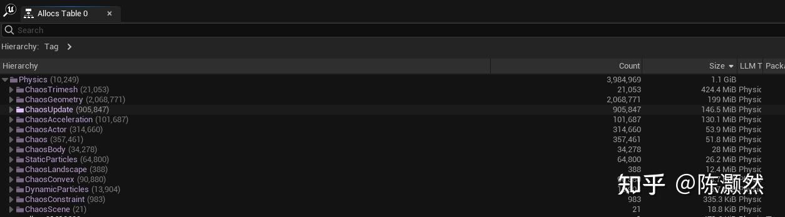
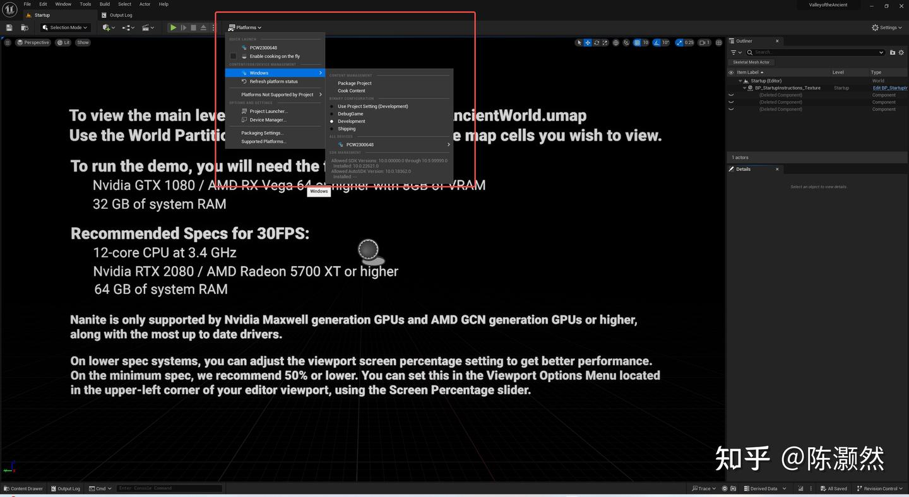
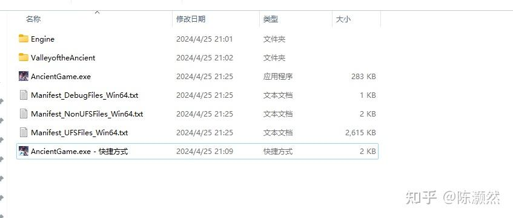
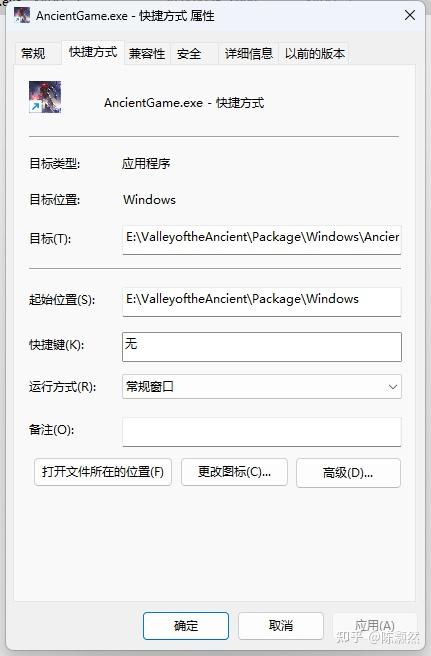
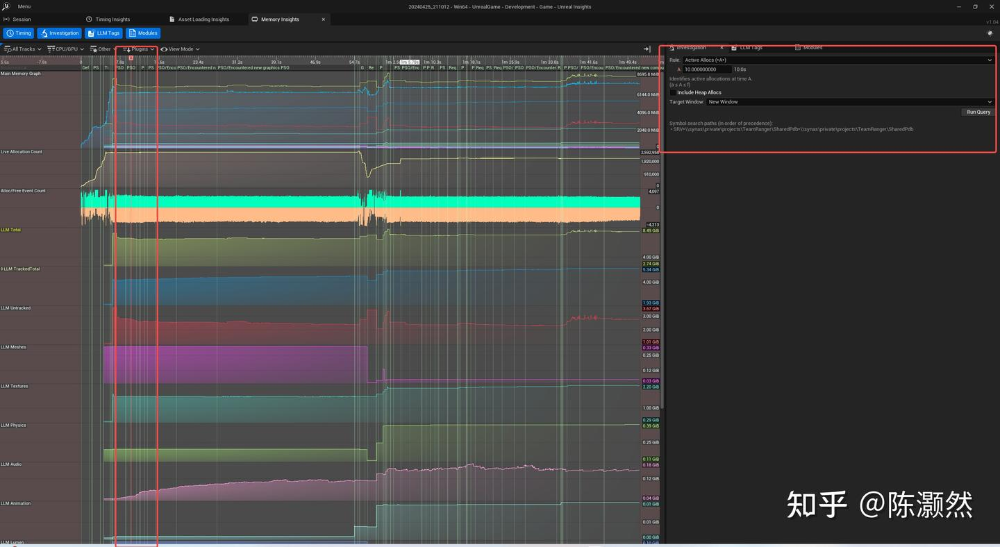
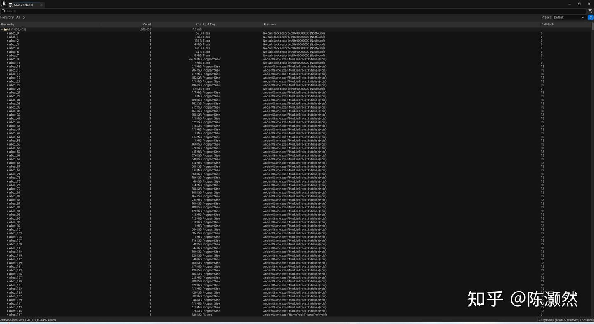
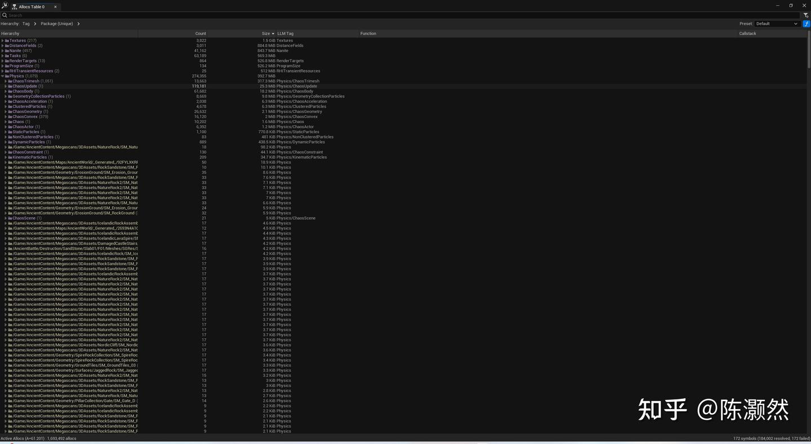
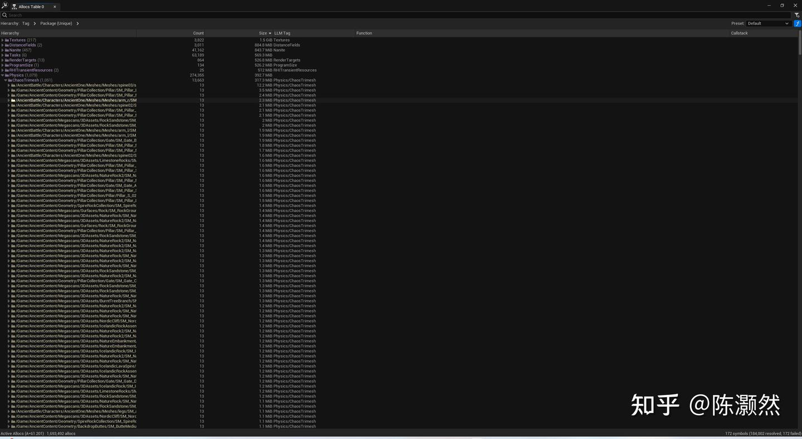
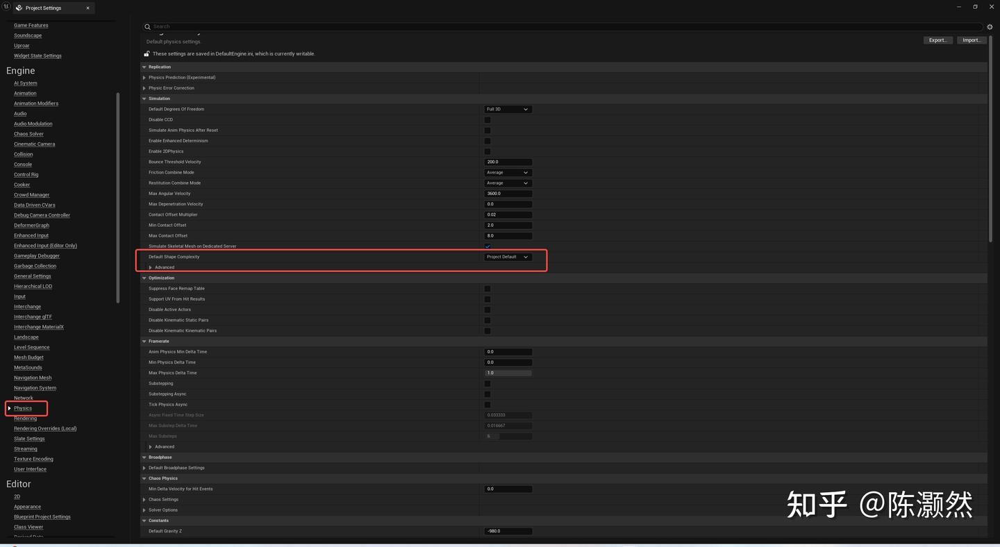
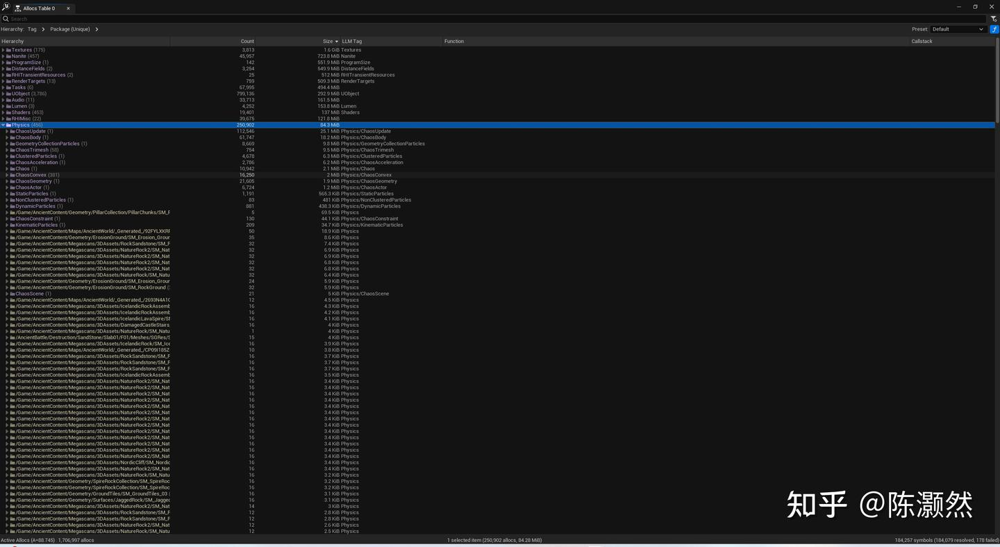

# 【UE5】최대 메모리 최적화 실전: Chaos 메모리

> 원문: [【UE5】内存峰值优化实战：Chaos内存 - Zhihu](https://zhuanlan.zhihu.com/p/694741394)



*Physics의 메모리 오버헤드 분포*

대형 게임 월드를 구축할 때, 물리 시스템의 메모리 점유율은 개발자들이 직면하는 주요 과제 중 하나입니다. 이 글에서는 물리 시스템의 메모리 할당을 심층적으로 분석하고, 개발자가 메모리 사용을 최적화하는 데 도움이 되는 효과적인 메모리 피크(Peak) 최적화 전략을 제공합니다.

## ChaosTrimesh

### 메모리 할당 시기

Chaos의 소스 코드에서 우리는 `ChaosTrimesh`가 메모리를 할당하는 위치를 확인할 수 있습니다.

```cpp
// ChaosDerivedDataReader.cpp
{
    LLM_SCOPE(ELLMTag::ChaosTrimesh);
    ChaosAr << TrimeshImplicitObjects << UVInfo << FaceRemap;
}
```

이 코드는 `TrimeshImplicitObjects`, `UVInfo`, `FaceRemap`의 세 가지 주요 메모리 할당 부분을 다룹니다. 메모리 분석을 개선하기 위해, 다음과 같이 세 가지 메모리 할당 영역을 추적하도록 소스 코드를 수정하는 것이 좋습니다.

```cpp
{
    LLM_SCOPE(ELLMTag::ChaosTrimesh);
    LLM_SCOPE_BYNAME(TEXT("Physics/TrimeshImplicitObjects"));
    ChaosAr << TrimeshImplicitObjects;
}
{
    LLM_SCOPE_BYNAME(TEXT("Physics/UVInfo"));
    ChaosAr << UVInfo;
}
{
    LLM_SCOPE_BYNAME(TEXT("Physics/FaceRemap"));
    ChaosAr << FaceRemap;
}
```

이렇게 소스를 수정하면 메모리 분석 도구에서 메모리 할당의 세 가지 측면을 더 명확하게 식별할 수 있습니다.

### TrimeshImplicitObjects

**사전 지식**

Chaos TriMesh는 일반적으로 복잡한 충돌 모델을 처리하는 데 사용됩니다. UE5에서 `ChaosTrimesh`와 `ChaosConvex`는 일반적으로 `UStaticMesh`가 로드될 때 메모리를 사전 할당합니다. 이 과정은 주로 `BodySetup.cpp`의 `FinishCreatingPhysicsMeshes_Chaos` 메서드에서 일어납니다. 구체적인 물리 기하체의 충돌 구축 과정은 `ChaosInterfaceUtils.cpp`에서 구현됩니다.

```cpp
// ChaosInterfaceUtils.cpp
// void CreateGeometry
const bool bMakeComplexGeometry = (CollisionTraceType != CTF_UseSimpleAsComplex) || (SimpleShapeCount == 0);
```

`bMakeComplexGeometry == true`인 경우 복잡한 충돌, 즉 `TrimeshImplicitObjects`가 생성됩니다.
게임 쿠킹(Cooking) 시, 프로젝트 설정 및 StaticMesh 설정에 따라 이 부분의 정보를 실제 패키지에 포함할지 여부를 결정합니다.

```cpp
// BodySetup.cpp
void UBodySetup::GetCookInfo(FCookBodySetupInfo& OutCookInfo, EPhysXMeshCookFlags InCookFlags) const
```

Complex Collision Mesh가 지정되면 이를 복합 충돌 메시로 사용하고, 그렇지 않으면 `LODForCollision`이 지정한 LOD를 복합 충돌 메시로 사용합니다.

```cpp
// StaticMesh.cpp
// bool UStaticMesh::GetPhysicsTriMeshDataCheckComplex
const int32 UseLODIndex = bInUseAllTriData ? 0 : FMath::Clamp(LODForCollision, 0, GetRenderData()->LODResources.Num()-1);

FStaticMeshLODResources& LOD = GetRenderData()->LODResources[UseLODIndex];
```

Nanite의 경우, NaniteMesh는 LOD가 없고 FallbackMesh를 사용합니다(FallbackMesh는 Nanite를 지원하지 않는 시스템에서 렌더링하기 위한 메시입니다). 마지막으로 Cook 단계에서 Chaos는 이 메시를 단순화하고 불필요한 버텍스를 제거하기 위해 몇 가지 정리(Cleaning) 작업을 수행하지만, 과정이 단순하지는 않습니다.

```cpp
// ChaosDerivedDataUtil.cpp
void CleanTrimesh(TArray<FVector3f>& InOutVertices, TArray<int32>& InOutIndices, TArray<int32>* OutOptFaceRemap, TArray<int32>* OutOptVertexRemap)
```

주로 중복되는 정점을 찾아 병합하고, AABB 트리와 같은 공간 가속 구조를 사용하여 공간상 가까운 정점을 빠르게 찾습니다. 중복으로 간주할 임계값 `WeldThresholdSq`를 설정하여 어느 정도 거리의 정점을 중복으로 처리할지 결정하고, 마지막으로 각 고유한(Unique) 정점에 새로운 인덱스를 할당한 뒤 모든 중복 정점을 이 새로운 인덱스에 매핑합니다.

**최적화 방법**

Complex 충돌이 필요 없는 항목에서 `Project Settings -> Engine -> Physics -> Simulation -> DefaultShapeComplexity` 옵션을 `UseSimpleCollisionAsComplex`로 변경하면 `TrimeshImplicitObjects` 부분의 메모리 할당을 제거할 수 있습니다. 프로젝트에 Complex 충돌이 필요한 경우, 각 `StaticMesh -> Collision -> Collision Complexity`에서 이 속성을 개별적으로 설정해야 합니다.

### UVInfo

**사전 지식**

```cpp
/** UV information for BodySetup, only created if UPhysicsSettings::bSupportUVFromHitResults */
struct FBodySetupUVInfo
{
    /** Index buffer, required to go from face index to UVs */
    TArray<int32> IndexBuffer;
    /** Vertex positions, used to determine barycentric co-ords */
    TArray<FVector> VertPositions;
    /** UV channels for each vertex */
    TArray< TArray<FVector2D> > VertUVs;

    friend FArchive& operator<<(FArchive& Ar, FBodySetupUVInfo& UVInfo)
    {
       Ar << UVInfo.IndexBuffer;
       Ar << UVInfo.VertPositions;
       Ar << UVInfo.VertUVs;

       return Ar;
    }

    /** Get resource size of UV info */
    void GetResourceSizeEx(FResourceSizeEx& CumulativeResourceSize) const;

    void FillFromTriMesh(const FTriMeshCollisionData& TriMeshCollisionData);
};
```

충돌 감지 시, 충돌 지점의 실제 메시 UV를 복원하기 위해 다양한 정보를 저장합니다.

```cpp
// StaticMesh.cpp
// bool UStaticMesh::GetPhysicsTriMeshDataCheckComplex
bool bCopyUVs = bSupportPhysicalMaterialMasks || UPhysicsSettings::Get()->bSupportUVFromHitResults; // See if we should copy UVs

// If copying UVs, allocate array for storing them
if (bCopyUVs)
{
    CollisionData->UVs.AddZeroed(LOD.GetNumTexCoords());
}
```

쿠킹된 데이터로부터 실제 게임 사용을 위한 충돌 정보를 구축하는 부분입니다.

**최적화 방법**

```cpp
/** 
 *  Try and find the UV for a collision impact. Note this ONLY works if 'Support UV From Hit Results' is enabled in Physics Settings.
 */
UFUNCTION(BlueprintPure, Category = "Collision")
static ENGINE_API bool FindCollisionUV(const struct FHitResult& Hit, int32 UVChannel, FVector2D& UV);
```

UVInfo의 경우, 프로젝트가 충돌 감지 결과를 통해 UV 좌표를 찾는 기능(예: `FindCollisionUV`)에 의존하지 않는다면, 프로젝트 설정에서 해당 지원 옵션을 꺼서 불필요한 메모리 소비를 줄일 수 있습니다.
`Project Settings -> Engine -> Physics -> Optimization -> SupportUVFromHitResults`를 비활성화합니다.
하지만 특정 Mesh에 `bSupportPhysicalMaterialMasks`가 체크되어 있다면, 실제 실행 시 해당 Mesh의 UV 정보가 생성됩니다.

### FaceRemap

**사전 지식**

```cpp
/** Additional face remap table, if available. Used for determining face index mapping from collision mesh to static mesh, for use with physical material masks */
TArray<int32> FaceRemap;
```

일반적으로 충돌 감지를 위해 3D 모델을 물리 엔진으로 가져올 때, 모델의 기하학적 데이터는 런타임 성능 향상을 위해 쿠킹 시 최적화된 형식으로 변환됩니다. 이 과정에서 UV 좌표와 면(Face) 인덱스와 같은 일부 원본 모델 데이터는 충돌 탐지에 필요하지 않기 때문에 제거될 수 있습니다.

그러나 어떤 경우에는 이러한 데이터를 유지하는 것이 유용합니다. 예를 들어 충돌 쿼리 결과에서 **Physical Material Mask**를 지원해야 하는 경우, 원본 모델의 UV 좌표 및 면 인덱스에 접근해야 합니다. Physical Material Mask는 개발자가 각 면에 대한 재질 유형을 정의할 수 있도록 하여, 재질의 물리적 특성(예: 마찰, 탄성)을 기반으로 충돌 반응을 미세 조정할 수 있게 합니다.

`FaceRemap` 테이블은 최적화된 메시 데이터와 원본 모델 데이터 간의 매핑을 설정하는 데 사용됩니다. FaceRemap을 지원할 때, 물리 메시는 Physical Material Mask를 지원하기 위해 UV 좌표와 면 인덱스 매핑 테이블을 저장합니다. 이는 최적화가 이루어지더라도 원본의 면 인덱스와 해당 UV 좌표를 이 매핑 테이블을 통해 복원할 수 있으며, 더 복잡한 상호 작용 효과를 구현하는 데 사용할 수 있음을 의미합니다.

**최적화 방법**

`FaceRemap`은 특정 StaticMesh에서 `bSupportPhysicalMaterialMasks`를 선택한 경우에만 생성되며, 일반적인 프로젝트에서는 오버헤드가 발생하지 않습니다.

## ChaosGeometry

### 메모리 할당 시기

```cpp
// PhysInterface_Chaos.cpp
void FPhysInterface_Chaos::AddGeometry(FPhysicsActorHandle& InActor, const FGeometryAddParams& InParams, TArray<FPhysicsShapeHandle>* OutOptShapes)
{
    TRACE_CPUPROFILER_EVENT_SCOPE(FPhysInterface_Chaos::AddGeometry);
    LLM_SCOPE(ELLMTag::ChaosGeometry);
    TArray<TUniquePtr<Chaos::FImplicitObject>> Geoms;
    Chaos::FShapesArray Shapes;
    ChaosInterface::CreateGeometry(InParams, Geoms, Shapes);
    ...
}
```

맵(레벨)을 로드하는 동안 Chaos 물리 시스템은 각 물체에 해당하는 충돌체를 생성하며, `ChaosGeometry`와 관련된 메모리 할당은 바로 이 단계에서 발생합니다.

```cpp
// ChaosInterfaceUtils.cpp
    void CreateGeometry(const FGeometryAddParams& InParams, TArray<TUniquePtr<Chaos::FImplicitObject>>& OutGeoms, Chaos::FShapesArray& OutShapes)
    {
       LLM_SCOPE(ELLMTag::ChaosGeometry);
       const FVector& Scale = InParams.Scale;
       TArray<TUniquePtr<Chaos::FImplicitObject>>& Geoms = OutGeoms;
       Chaos::FShapesArray& Shapes = OutShapes;

       ECollisionTraceFlag CollisionTraceType = InParams.CollisionTraceType;
       ...
}
```

`CreateGeometry` 함수 내부에서 Chaos 엔진은 각 기본 기하학적 형상(구, 큐브, 캡슐, 원추형 캡슐 등)에 대해 `ImplicitObjects`를 구성합니다. `FImplicitObject`에는 구의 위치와 반지름과 같은 모양에 대한 실제 기하학적 데이터가 포함되어 있습니다.

```cpp
// ChaosInterfaceUtils.cpp
for (const FKSphereElem& SphereElem : InParams.Geometry->SphereElems)
{
    const FKSphereElem ScaledSphereElem = SphereElem.GetFinalScaled(Scale, InParams.LocalTransform);
    const float UseRadius = FMath::Max(ScaledSphereElem.Radius, UE_KINDA_SMALL_NUMBER);
    auto ImplicitSphere = MakeUnique<Chaos::TSphere<Chaos::FReal, 3>>(ScaledSphereElem.Center, UseRadius);
    TUniquePtr<Chaos::FPerShapeData> NewShape = NewShapeHelper(MakeSerializable(ImplicitSphere), Shapes.Num(), (void*)SphereElem.GetUserData(), SphereElem.GetCollisionEnabled());
    Shapes.Emplace(MoveTemp(NewShape));
    Geoms.Emplace(MoveTemp(ImplicitSphere));
}
```

구형 충돌체 생성을 예로 들면, `class TSphere final : public FImplicitObject`에서 Chaos는 모든 구형 기하 요소(`FKSphereElem`)를 순회하고, 각 요소에 대해 해당 `Chaos::FPerShapeData` 및 `Chaos::TSphere`를 생성한 다음, 이를 셰이프 및 기하학 컬렉션에 추가하여 Chaos 물리 엔진에서 사용할 수 있게 합니다.

**최적화 제안**

장면 내의 총 충돌체 수를 줄이거나, 복잡한 Convex Hull(볼록 포포) 기하학 대신 단순한 기하학(Primitive)을 사용하는 것이 가장 간단하고 효과적인 전략입니다. 이렇게 하면 메모리 점유율을 줄일 수 있을 뿐만 아니라 물리 시뮬레이션의 계산 효율성도 높일 수 있습니다.

## ChaosUpdate

`LLM_SCOPE(ELLMTag::ChaosUpdate)`로 표기된 곳을 통해 `ChaosUpdate`가 메모리를 할당하는 코드는 모두 `PhysicsSolverBase.cpp`에 있음을 알 수 있습니다. 대부분의 메모리 할당 오버헤드는 지오메트리마다 셰이프 인스턴스(Shape Instance)를 생성하는 데서 발생합니다.

```cpp
// ShapeInstance.cpp 
CHAOS_API static TUniquePtr<FShapeInstance> Make(int32 InShapeIdx, TSerializablePtr<FImplicitObject> InGeometry);
```

### 기술적 배경

```cpp
class FShapeInstance : public FPerShapeData
{
    ...
    union FMaterialUnion
{
    FMaterialUnion() : MaterialHandle() {}    // Default to single-shape mode
    ~FMaterialUnion() {}                  // Destruction handled by FShapeInstance

    FMaterialHandle MaterialHandle;             // Set if we have only 1 material, no masks etc
    FMaterialData* MaterialData;            // Set if we have multiple materials or any masks
};
FCollisionData CollisionData;
mutable FMaterialUnion Material;

// FPerShapeData
EPerShapeDataType Type : 2;
uint32 bIsSingleMaterial : 1;   // For use by FShapeInstance (here because the space is available for free)
uint32 ShapeIdx : 29;
FShapeDirtyFlags DirtyFlags;    // For use by FShapeInstanceProxy as there's 4 bytes of padding here
TSerializablePtr<FImplicitObject> Geometry;
TAABB<FReal, 3> WorldSpaceInflatedShapeBounds;
    ...
}

struct FCollisionData
{
    FCollisionFilterData QueryData;
    FCollisionFilterData SimData;
    void* UserData;
    EChaosCollisionTraceFlag CollisionTraceType;
    uint8 bSimCollision : 1;
    uint8 bQueryCollision : 1;
    uint8 bIsProbe : 1;
    ...    
}
```

Chaos는 계산 복잡성을 줄이기 위해 객체의 물리적 행동을 가장 간소화된 방식으로 처리하는 것을 목표로 합니다. 이 프레임워크에서는 구와 큐브와 같은 간단한 기하학적 형태(Primitives)가 선호됩니다. 이 방법은 효율적이지만 더 복잡한 물체를 처리하는 데 한계가 있습니다.

현실 세계의 다양한 물체를 보다 정확하게 시뮬레이션하기 위해 Chaos는 **ConvexMesh** 개념을 도입했습니다. 단순한 구면이든 삼각형으로 구성된 복잡한 메시이든 간에, 그것들은 ConvexMesh, 즉 3D 기하학적 표현의 기초입니다.

기술적 수준에서 ConvexMesh는 `FImplicitObject`(및 그 하위 클래스)와 `FPerShapeData`의 두 가지 주요 데이터 유형으로 표시됩니다.
*   `FImplicitObject`: 주로 형상의 기본 기하학적 데이터를 담고 있으며, 예를 들어 구의 경우 중심 위치와 반지름 등의 정보를 포함합니다.
*   `FPerShapeData`: 물리적 재질(Physics Material) 및 충돌 반응 채널과 같이 순수한 기하학적 정보가 아닌 셰이프의 다른 중요한 속성을 포함합니다.

### 최적화 제안

이 부분은 `ChaosGeometry`와 유사하며, 충돌 시의 다른 정보(Collision Data 등)에 속합니다. `ChaosUpdate`의 메모리가 너무 높으면 장면 내 충돌체 총수가 너무 많다는 것을 의미합니다.

## ChaosAcceleration

### 기술적 배경

`LLM_SCOPE(ELLMTag::ChaosAcceleration)`로 표기된 곳을 통해 `ChaosAcceleration`이 할당하는 메모리 코드는 모두 `PBDRigidsEvolution.cpp`에 있음을 알 수 있습니다. 이 부분의 메모리는 공간 가속 구조(Spatial Acceleration)를 구성하는 데 사용됩니다.

```cpp
// ISpatialAcceleration.h
using SpatialAccelerationType = uint8;  //see ESpatialAcceleration. Projects can add their own custom types by using enum values higher than ESpatialAcceleration::Unknown
enum class ESpatialAcceleration : SpatialAccelerationType
{
    BoundingVolume,
    AABBTree,
    AABBTreeBV,
    Collection,
    Unknown,
    //For custom types continue the enum after ESpatialAcceleration::Unknown
};
```

UE5에는 위의 가속 구조가 있으며 실제 프로젝트에서 대부분의 메모리는 **AABBTree**를 구성하는 데 사용됩니다.
AABBTree는 강체(Rigid Body)의 추가, 삭제 또는 강체의 상태(위치, 회전 등)가 변경될 때 업데이트됩니다. 이는 AABB 트리의 구조가 강체의 AABB(Axis-Aligned Bounding Box, 축 정렬 경계 상자)에 의존하며, 강체의 상태가 변경되면 AABB 트리의 구조에 영향을 미칠 수 있기 때문입니다.

새로운 강체가 월드에 추가되고 AABBTree가 아직 업데이트되지 않은 경우, 충돌 감지는 이러한 새로운 강체를 독립적인 개체(`DirtyElements`)로 처리합니다. 이것은 충돌 감지 중에 트리에 없는 이러한 강체가 추가로 고려된다는 것을 의미합니다. 이 접근 방식은 트리 구조가 업데이트되지 않은 경우에도 새로 추가된 강체가 충돌 감지에 참여할 수 있도록 합니다. 트리 구조가 업데이트되면, 캐시된 강체들은 새로운 트리 구조에 통합되고 메인 스레드의 AABB 트리로 업데이트됩니다.

이진 트리는 균형 트리(Balanced Tree)인지 여부를 고려해야 하는데, 균형 트리가 아닌 경우 빈번한 추가/삭제 후 쿼리 효율성이 연결 리스트(Linked List) 수준으로 저하될 수 있습니다. 그러나 실제 개발에서는 균형 작업을 위해 노드를 삽입할 때마다 발생하는 오버헤드도 받아들이기 어려우며, Chaos에서는 이를 처리하기 위해 절충안(Trade-off)을 사용합니다.

```cpp
// AABBTree.h
// Chaos의 삽입 위치 탐색 방법:
int32 FindBestSibling(const TAABB<T, 3>& InNewBounds, bool& bOutAddToLeaf)
```

최적의 삽입 위치를 찾는 이 방법은 휴리스틱(Heuristic) 방식을 기반으로 하며 트리의 균형을 완벽하게 보장하지는 않습니다. 따라서 이 방법으로 구성된 트리는 반드시 평형 이진 트리가 아닙니다. 대신, 휴리스틱 평가를 기반으로 한 '거의 최적'의 이진 트리이며, 이러한 트리는 실제 적용에서 충분히 잘 작동할 수 있지만 이진 트리의 균형을 엄격하게 보장하지는 않습니다.

```cpp
template <typename TPayloadType, bool bComputeBounds = true, typename T = FReal>
struct TAABBTreeLeafArray : public TBoundsWrapperHelper<TPayloadType, T, bComputeBounds>
{
...
    TArray<TPayloadBoundsElement<TPayloadType, T>> Elems;
    bool bDirtyLeaf = false;
...
}
```

`TAABBTree`의 비-리프(Non-leaf) 노드는 `TAABBTreeNode`로, 부모/자식 노드를 가리키는 인덱스를 제외하고 주요 정보는 두 자식 노드의 AABB입니다.

`TAABBTree`의 리프(Leaf) 노드에는 `TAABBTreeLeafArray<FAccelerationStructureHandle>`이라는 배열이 포함되어 있습니다.

```cpp
class FAccelerationStructureHandle
{
...
    FGeometryParticle* ExternalGeometryParticle;
    FGeometryParticleHandle* GeometryParticleHandle;
    
    FUniqueIdx CachedUniqueIdx;
    FCollisionFilterData UnionQueryFilterData;
    FCollisionFilterData UnionSimFilterData;
    bool bCanPrePreFilter;
...
}
template <typename T, int d>
class TGeometryParticle
{
...
    TChaosProperty<FParticlePositionRotation, EChaosProperty::XR> MXR;
    TChaosProperty<FParticleNonFrequentData,EChaosProperty::NonFrequentData> MNonFrequentData;
    void* MUserData;
    
    FShapeInstanceProxyArray MShapesArray;
...
}
class FParticleNonFrequentData
{
    ...
    TSharedPtr<const FImplicitObject,ESPMode::ThreadSafe> MGeometry;
    FUniqueIdx MUniqueIdx;
    FSpatialAccelerationIdx MSpatialIdx;
    FParticleID MParticleID;
    EResimType MResimType;
    bool MEnabledDuringResim;
    ...
}
```

`FAccelerationStructureHandle` 클래스에서 각 리프 노드는 변위, 회전, 기하학적 포인터 및 기타 관련 물리/충돌 속성을 포함하는 하나 이상의 `FGeometryParticle` 인스턴스와 연관됩니다.

### 최적화 제안

강체 위치와 회전의 변화는 AABBTree의 재구성으로 이어지며, **ChaosAcceleration** 메모리를 최적화하는 핵심은 게임 월드에서 매 프레임 움직이는 충돌체의 수를 줄이는 것입니다.

## AncientValley 실전

### 프로젝트 다운로드 & 패키징


먼저 Epic Games Launcher에서 **Ancient Valley** 프로젝트를 다운로드합니다.



프로젝트를 연 후 패키징을 진행합니다. 타겟 플랫폼은 Windows를 선택하고, 콘솔 명령(필요한 경우)을 쉽게 입력할 수 있도록 **Development** 빌드로 패키징합니다.
에디터 상에서도 메모리 분석을 할 수 있지만, 에디터 자체의 리소스가 많이 로드되므로 정확한 분석을 위해 실제 게임(빌드된 버전)에서 테스트하는 것이 좋습니다.

### 메모리 분석 시작 준비



패키징(압축 해제)이 완료된 후 실행 파일의 바로 가기를 만듭니다.



바로 가기 속성에서 '대상(T)' 뒤에 한 칸 띄우고 아래의 실행 인자를 추가하여 메모리 분석을 진행합니다.
추천 파라미터:
`-trace=default,memory,metadata,assetmetadata,loadtime -tracehost=127.0.0.1 -llm`

(`-tracehost=127.0.0.1`은 로컬 호스트 IP입니다. Unreal Insights가 실행 중인 PC의 IP를 입력하세요.)

그리고 **Unreal Insights**를 켜둔 상태에서 이 바로 가기를 실행하면 메모리 분석이 시작됩니다. 보스(Boss)와 전투를 진행하는 등 부하를 준 뒤 종료하면 됩니다.

### 메모리 분석



Unreal Insights에서 빨간색 상자의 `A` 마커를 `LLM Total`의 가장 높은 지점까지 드래그하고, Rule은 `ActiveAllocs`를 선택한 뒤 `Run Query`를 클릭합니다.



상단의 `Hierarchy` 피벗을 조정하여 먼저 태그(Tag)별로 정렬하고 그 다음 패키지(Package)별로 확인합니다.



이 프로젝트의 Physics 메모리는 주로 `ChaosTrimesh`에서 사용된다는 것을 알 수 있습니다.



패키지별로 정렬하여 펼쳐보면 구체적인 에셋 이름을 확인할 수 있습니다.

### 문제 해결



위에서 언급한 대로 프로젝트 설정의 `DefaultShapeComplexity`를 `UseSimpleAsComplex`로 변경합니다. 복잡한 충돌이 꼭 필요한 특정 에셋은 개별적으로 설정을 덮어씌운(Override) 후, 다시 패키징하여 테스트합니다.



최적화 후, 프로젝트의 Physics 메모리 피크가 392MB에서 84.3MB로 감소한 것을 확인할 수 있습니다. `ChaosTrimesh` 부분은 317MB에서 9.5MB로 획기적으로 줄어들었습니다.

## 마치며

이 글은 분량 제한으로 인해 모든 내용을 담지는 못했지만, 독자들이 UE5 프로젝트에서 메모리 피크를 최적화하는 데 도움이 되기를 바랍니다. 읽어주셔서 감사합니다.

---
**참고 자료**
[https://itscai.us/blog/post/ue-physics-framework/](https://itscai.us/blog/post/ue-physics-framework/)
