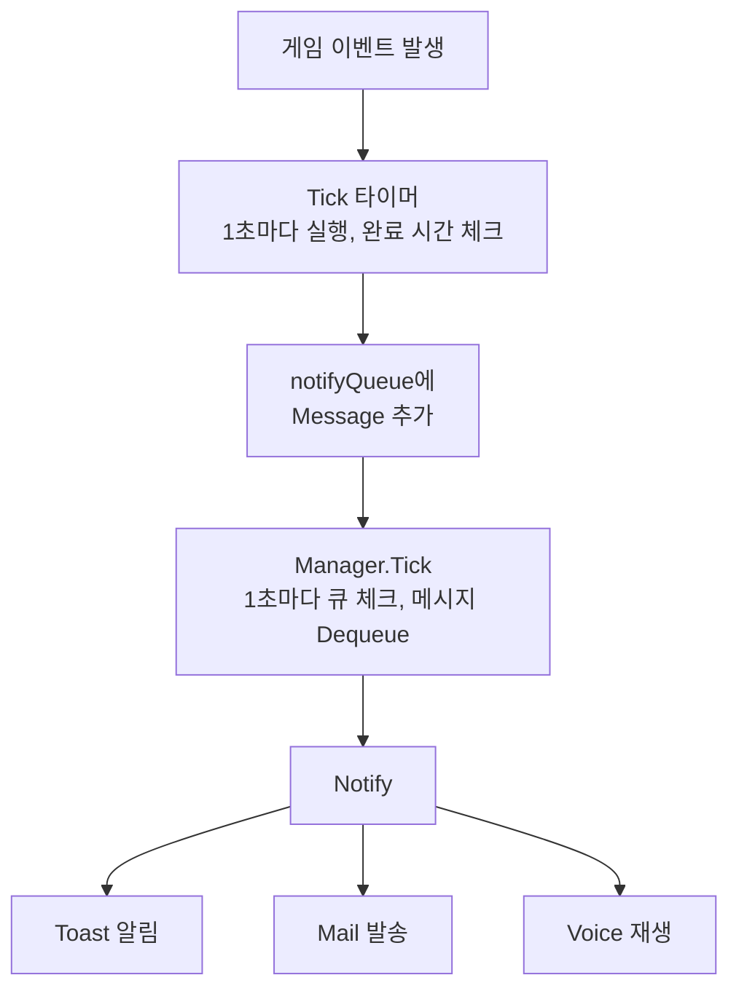

# GFAlarm 소스코드 분석 레포트 - Part 3: UI 및 알림 시스템

> 분석일: 2026-01-19
> 소스 위치: `E:\Workspace\GFAlarm\GFAlarm\Window`, `E:\Workspace\GFAlarm\GFAlarm\Notifier`

---

## 1. Window 시스템 개요

### 1.1 파일 구성

```
Window/
├── MainWindow.xaml       # 메인 윈도우 XAML
├── MainWindow.xaml.cs    # 메인 윈도우 코드 (2304줄)
├── SubWindow.xaml        # 서브 윈도우 XAML
└── SubWindow.xaml.cs     # 서브 윈도우 코드 (291줄)
```

---

## 2. MainWindow.xaml.cs 상세 분석

### 2.1 클래스 구조 개요

```csharp
public partial class MainWindow : Window
{
    // === 정적 뷰 인스턴스 (싱글톤 패턴) ===
    public static DashboardView dashboardView;
    public static EchelonView echelonView;
    public static QuestView questView;
    public static ProxyView proxyView;
    public static SettingView settingView;
    public static SettingAlarmView settingAlarmView;
    public static ProxyGuideView proxyGuideView;

    // === 타이머 시스템 ===
    private Timer timer;

    // === 트레이 아이콘 ===
    private NotifyIcon notifyIcon;

    // === 미디어 플레이어 ===
    private MediaPlayer mediaPlayer;

    // === Sticky Window ===
    private Point currentPoint;
    private double dpiMuliply;
}
```

### 2.2 정적 뷰 인스턴스 (62-69줄)

모든 뷰를 정적으로 선언하여 전역 접근을 허용합니다:

```csharp
// MainWindow.xaml.cs:62-69
public static DashboardView dashboardView = new DashboardView();
public static EchelonView echelonView = new EchelonView();
public static QuestView questView = new QuestView();
public static ProxyView proxyView = new ProxyView();
public static SettingView settingView = new SettingView();
public static SettingAlarmView settingAlarmView = new SettingAlarmView();
public static ProxyGuideView proxyGuideView = new ProxyGuideView();
```

**설계 의도:**
- 다른 클래스에서 `MainWindow.dashboardView.Update()` 형태로 접근 가능
- 패킷 처리 시 UI 업데이트를 위해 필요

### 2.3 Footer 상태 플래그 (71-195줄)

대시보드 하단에 표시되는 상태 정보를 관리하는 프로퍼티들:

```csharp
// 모의작전 점수 최대 도달
public bool isMaxBp
{
    get { return _isMaxBp; }
    set
    {
        _isMaxBp = value;
        dashboardView.TB_MaxBpPoint.Visibility =
            _isMaxBp ? Visibility.Visible : Visibility.Hidden;
    }
}

// 자유경험치 최대 도달
public bool isMaxGlobalExp { get; set; }

// 작전보고서 완료
public bool isCompleteBattleReport { get; set; }

// 지원 최대
public bool isMaxReinforce { get; set; }

// 인형 보유 최대
public bool isMaxDoll { get; set; }

// 장비 보유 최대
public bool isMaxEquip { get; set; }
```

### 2.4 핵심: Tick() 메서드 (200-674줄)

**1초마다 실행되는 타이머 콜백**으로, 모든 시간 기반 알림의 핵심 로직입니다.

```csharp
// MainWindow.xaml.cs:200-674
private void Tick(object state)
{
    int nowTime = TimeUtil.GetCurrentSec();

    // ========== 1. 모의작전 (Combat Simulation) ==========
    int maxBpPoint = UserData.CombatSimulation.maxBpPoint;
    int bpPoint = UserData.CombatSimulation.GetCurrentBpPoint();

    if (bpPoint >= maxBpPoint)
    {
        if (Config.Alarm.notifyMaxBpPoint && !_isMaxBp)
        {
            Notifier.Manager.notifyQueue.Enqueue(new Message()
            {
                send = MessageSend.All,
                type = MessageType.reach_max_bp_point,
                subject = "모의작전 점수 최대",
                content = "모의작전 점수가 최대입니다"
            });
        }
        isMaxBp = true;
    }

    // ========== 2. 작전보고서 (Battle Report) ==========
    foreach (var item in UserData.BattleReport.list.ToArray())
    {
        if (nowTime > item.endTime - Config.Extra.earlyNotifySeconds)
        {
            if (!item.notified)
            {
                item.notified = true;
                Notifier.Manager.notifyQueue.Enqueue(new Message()
                {
                    send = MessageSend.All,
                    type = MessageType.complete_battle_report,
                    subject = "작전보고서 완료",
                    content = "작전보고서 작성이 완료되었습니다"
                });
            }
        }
    }

    // ========== 3. 군수지원/자율작전 (Dispatched Echelon) ==========
    foreach (var item in UserData.Echelon.dispatchedList.ToArray())
    {
        if (nowTime > item.endTime - Config.Extra.earlyNotifySeconds)
        {
            if (!item.notified)
            {
                item.notified = true;

                string operationName = GameData.Operation.GetName(item.operationId);
                Notifier.Manager.notifyQueue.Enqueue(new Message()
                {
                    send = MessageSend.All,
                    type = item.isAutoMission ?
                           MessageType.complete_auto_mission :
                           MessageType.complete_operation,
                    subject = "군수지원 완료",
                    content = string.Format("{0}제대 {1} 완료",
                              item.teamId, operationName)
                });
            }
        }
    }

    // ========== 4. 인형 수복 (Restore Doll) ==========
    // ========== 5. 인형 제조 (Produce Doll) ==========
    // ========== 6. 장비/요정 제조 (Produce Equip) ==========
    // ========== 7. 스킬 훈련 (Skill Train) ==========
    // ========== 8. 자료 분석 (Data Analysis) ==========
    // ========== 9. 탐색 (Explore) ==========

    // ... 각 항목에 대해 동일한 패턴으로 처리
}
```

**알림 발생 조건 패턴:**
```csharp
// 현재 시간이 (완료 시간 - 사전알림 시간)을 지났는지 체크
if (nowTime > item.endTime - Config.Extra.earlyNotifySeconds)
{
    if (!item.notified)  // 중복 알림 방지
    {
        item.notified = true;
        Notifier.Manager.notifyQueue.Enqueue(new Message() { ... });
    }
}
```

### 2.5 사이드 메뉴 시스템 (676-1014줄)

#### 메뉴 정의

```csharp
// Constants/Menus.cs
public static class Menus
{
    public const int DASHBOARD = 0;
    public const int ECHELON = 1;
    public const int QUEST = 2;
    public const int PROXY = 3;
    public const int SETTING_ALARM = 4;
    public const int SETTING = 5;
    public const int GUIDE = 6;
}
```

#### 메뉴 클릭 처리

```csharp
// MainWindow.xaml.cs - 메뉴 클릭
private void BT_MenuDashboard_Click(object sender, RoutedEventArgs e)
{
    this.SideMenuClose();
    this.ChangeContent(Menus.DASHBOARD);  // 메인 윈도우에 표시
}

private void BT_MenuDashboard_MouseRightButtonDown(object sender, MouseButtonEventArgs e)
{
    this.SideMenuClose();
    this.SetSubWindow(Menus.DASHBOARD);   // 서브 윈도우에 표시
}
```

#### 마우스 휠 메뉴 순환

```csharp
// MainWindow.xaml.cs - 마우스 휠로 메뉴 순환
private void SideMenuToggle_MouseWheel(object sender, MouseWheelEventArgs e)
{
    if (e.Delta > 0)  // 위로 스크롤
    {
        currentMenu--;
        if (currentMenu < 0)
            currentMenu = maxMenu;
    }
    else  // 아래로 스크롤
    {
        currentMenu++;
        if (currentMenu > maxMenu)
            currentMenu = 0;
    }
    ChangeContent(currentMenu);
}
```

### 2.6 헤더 메뉴 - 필터링/정렬 (1171-1716줄)

#### 대시보드 필터 토글

```csharp
// MainWindow.xaml.cs - 그룹별 표시/숨김 토글
private void BT_FilterOperation_Click(object sender, RoutedEventArgs e)
{
    Config.Filter.operation = !Config.Filter.operation;
    dashboardView.filter = true;
    BT_FilterOperation.Opacity = Config.Filter.operation ? 1.0 : 0.3;
}

private void BT_FilterProduceDoll_Click(object sender, RoutedEventArgs e)
{
    Config.Filter.produceDoll = !Config.Filter.produceDoll;
    dashboardView.filter = true;
    BT_FilterProduceDoll.Opacity = Config.Filter.produceDoll ? 1.0 : 0.3;
}

// 필터 종류: operation, produceDoll, produceEquip, skillTrain,
//           dataAnalysis, restore, explore
```

#### 정렬 시스템

```csharp
// MainWindow.xaml.cs - 정렬 토글
private void BT_Sort_Click(object sender, RoutedEventArgs e)
{
    if (Config.Sort.type == "slot")
    {
        Config.Sort.type = "remainTime";  // 남은 시간순
    }
    else
    {
        Config.Sort.type = "slot";        // 슬롯 순서
    }
    dashboardView.sort = true;
}
```

#### 경험치 계산기

```csharp
// MainWindow.xaml.cs - 경험치 계산기 프리셋
// 4-3E, 0-2, 10-4E, 8-1N, 11-5, 4드라 등
private void BT_ExpCalcPreset43E_Click(object sender, RoutedEventArgs e)
{
    // 4-3E 설정
    baseExp = 370;       // 기본 경험치
    battleCount = 5;     // 전투 횟수
    levelPenalty = 90;   // 레벨 페널티 시작점
}

// 경험치 계산 공식
int totalExp = baseExp * battleCount * (100 - Math.Max(0, level - levelPenalty)) / 100;
```

### 2.7 생성자 및 초기화 (1721-1937줄)

```csharp
// MainWindow.xaml.cs - 생성자
public MainWindow()
{
    InitializeComponent();

    // ===== 트레이 아이콘 설정 =====
    notifyIcon = new NotifyIcon();
    notifyIcon.Icon = new System.Drawing.Icon("icon.ico");
    notifyIcon.Visible = true;
    notifyIcon.Text = "소녀전선 알리미";

    // 더블클릭 시 창 복원
    notifyIcon.DoubleClick += (s, e) =>
    {
        this.Show();
        this.WindowState = WindowState.Normal;
    };

    // 우클릭 컨텍스트 메뉴
    notifyIcon.ContextMenuStrip = new ContextMenuStrip();
    notifyIcon.ContextMenuStrip.Items.Add("열기", null, (s, e) => { this.Show(); });
    notifyIcon.ContextMenuStrip.Items.Add("종료", null, (s, e) => { Application.Current.Shutdown(); });

    // ===== 1초 타이머 시작 =====
    timer = new Timer(Tick, null, 0, 1000);

    // ===== DB 업데이트 체크 =====
    if (Config.Setting.checkUpdateDb)
    {
        // GitHub에서 최신 데이터 다운로드
        // doll.json, equip.json, fairy.json 등
        Task.Run(() => UpdateDatabase());
    }

    // ===== 프록시 서버 시작 =====
    if (Config.Proxy.autoStart)
    {
        ProxyController.instance.Start();
        HttpController.instance.Start();
    }
}
```

### 2.8 Sticky Window 기능 (2176-2268줄)

화면 가장자리에 윈도우가 자동으로 달라붙는 기능:

```csharp
// MainWindow.xaml.cs - Sticky Window
protected override void OnLocationChanged(EventArgs e)
{
    base.OnLocationChanged(e);

    if (Config.Window.stickyWindow)
    {
        int snappingMargin = 10;  // 10픽셀 이내면 달라붙음

        // 화면 작업 영역
        var workArea = SystemParameters.WorkArea;

        // 좌측 가장자리 스냅
        if (Math.Abs(this.Left) < snappingMargin)
            this.Left = 0;

        // 우측 가장자리 스냅
        if (Math.Abs(this.Left + this.Width - workArea.Width) < snappingMargin)
            this.Left = workArea.Width - this.Width;

        // 상단 가장자리 스냅
        if (Math.Abs(this.Top) < snappingMargin)
            this.Top = 0;

        // 하단 가장자리 스냅
        if (Math.Abs(this.Top + this.Height - workArea.Height) < snappingMargin)
            this.Top = workArea.Height - this.Height;
    }
}
```

### 2.9 DPI 스케일링 처리

```csharp
// MainWindow.xaml.cs - DPI 보정
private void CalculateDpiMultiplier()
{
    PresentationSource source = PresentationSource.FromVisual(this);
    if (source != null)
    {
        double dpiX = 96.0 * source.CompositionTarget.TransformToDevice.M11;
        dpiMuliply = 96.0 / dpiX;
    }
}
```

---

## 3. SubWindow.xaml.cs 분석

### 3.1 개요

메인 윈도우의 뷰를 별도 창에 표시하는 서브 윈도우입니다. 듀얼 모니터 환경에서 유용합니다.

### 3.2 뷰 설정

```csharp
// SubWindow.xaml.cs - 뷰 컨텐츠 설정
public void SetContent(int menu)
{
    switch (menu)
    {
        case Menus.DASHBOARD:
            this.ViewContentControl.Content = MainWindow.dashboardView;
            this.Title = "대시보드";
            break;
        case Menus.ECHELON:
            this.ViewContentControl.Content = MainWindow.echelonView;
            this.Title = "제대";
            break;
        case Menus.QUEST:
            this.ViewContentControl.Content = MainWindow.questView;
            this.Title = "임무";
            break;
        // ...
    }
}
```

**핵심 포인트:**
- 메인 윈도우와 **동일한 뷰 인스턴스를 공유**
- 뷰를 한 윈도우에서 다른 윈도우로 이동시키는 방식

### 3.3 위치 정렬 기능

```csharp
// SubWindow.xaml.cs - 메인 윈도우 옆에 정렬
private void BT_AttachLeft_Click(object sender, RoutedEventArgs e)
{
    // 메인 윈도우 왼쪽에 붙이기
    this.Left = MainWindow.view.Left - this.Width;
    this.Top = MainWindow.view.Top;
}

private void BT_AttachRight_Click(object sender, RoutedEventArgs e)
{
    // 메인 윈도우 오른쪽에 붙이기
    this.Left = MainWindow.view.Left + MainWindow.view.Width;
    this.Top = MainWindow.view.Top;
}
```

---

## 4. Notifier 시스템 분석

### 4.1 파일 구성

```
Notifier/
├── Manager.cs    # 알림 관리자 (메인 컨트롤러)
├── Message.cs    # 메시지 데이터 모델
├── Toast.cs      # Windows 10 토스트 알림
└── Mail.cs       # 이메일 알림
```

### 4.2 Manager.cs - 알림 관리자

```csharp
// Notifier/Manager.cs
public static class Manager
{
    private static readonly Logger log = LogManager.GetCurrentClassLogger();

    // 트레이 알림 소리
    private static SoundPlayer soundPlayer = new SoundPlayer();

    // 알림 처리 타이머 (1초 간격)
    private static Timer timer = new Timer(Tick, null, 0, 1000);

    // 메시지 큐 (순차 처리)
    public static Queue<Message> notifyQueue = new Queue<Message>();

    /// <summary>
    /// 1초마다 큐에서 메시지를 꺼내 알림 발송
    /// </summary>
    private static void Tick(object state)
    {
        if (notifyQueue.Count() > 0)
        {
            Message msg = notifyQueue.Dequeue();

            // 딜레이가 있으면 대기
            if (msg.delay > 0)
            {
                Thread.Sleep(msg.delay);
            }

            // 타이머 재설정 (알림 간 3초 간격)
            timer.Change(Timeout.Infinite, Timeout.Infinite);
            timer = new Timer(Tick, null, 3000, 1000);

            Notify(msg);
        }
    }
}
```

### 4.3 알림 라우팅

```csharp
// Notifier/Manager.cs:53-80
private static void Notify(Message msg)
{
    switch(msg.send)
    {
        // 모든 알림 채널
        case MessageSend.All:
            if (Config.Setting.winToast)
                ShowWinToast(msg);
            if (Config.Setting.mailNotification)
                SendMail(msg);
            break;

        // 토스트만
        case MessageSend.Toast:
            if (Config.Setting.winToast)
                ShowWinToast(msg);
            break;

        // 이메일만
        case MessageSend.Mail:
            if (Config.Setting.mailNotification)
                SendMail(msg);
            break;

        // 음성만
        case MessageSend.Voice:
            if (Config.Setting.voiceNotification)
                PlayVoice(msg);
            break;
    }
}
```

### 4.4 음성 알림 시스템

```csharp
// Notifier/Manager.cs:124-402 - 음성 파일 경로 결정
private static string GetVoiceFile(int gunId, int skinId, MessageType msgType)
{
    string path = string.Format("{0}", gunId);

    // 아동절 스킨 여부 체크
    List<int> childSkinIds = GameData.Doll.GetDollSkin(false, true);
    if (childSkinIds.Contains(skinId))
    {
        path += "_pedo";  // 별도 폴더
    }

    string voice = "";
    switch (msgType)
    {
        // 완료 알림
        case MessageType.complete_operation:
            voice = "complete_operation";
            break;
        case MessageType.complete_produce_doll:
            voice = "complete_produce_doll";
            break;
        case MessageType.complete_skill_train:
            voice = "complete_skill_train";
            break;

        // 일간임무 달성
        case MessageType.acheive_daily_combat_sim:
            voice = "acheive_combat_sim";
            break;
        // ... 수십 개의 음성 타입

        // 랜덤 음성
        case MessageType.random:
            string[] files = Directory.GetFiles(tempPath, "*.wav");
            if (files.Length > 0)
            {
                int randIdx = new Random().Next(0, files.Length);
                return files[randIdx];
            }
            break;
    }

    // 파일 경로 조합
    if (gunId == 0)
    {
        // TTS 음성
        filename = string.Format("{0}\\Resource\\Sound\\{1}\\{2}.wav",
            basePath, Config.Setting.language, voice);
    }
    else
    {
        // 인형 음성
        filename = string.Format("{0}\\Resource\\Sound\\Voice\\{1}\\{2}.wav",
            basePath, path, voice);
    }

    return filename;
}
```

### 4.5 Toast.cs - Windows 10 토스트 알림

```csharp
// Notifier/Toast.cs
public static class Toast
{
    private const String APP_ID = "소녀전선 알리미";
    private static ToastNotifier toastNotifier = null;

    static Toast()
    {
        try
        {
            TryCreateShortcut();  // 시작 메뉴 바로가기 생성
            toastNotifier = ToastNotificationManager.CreateToastNotifier(APP_ID);
        }
        catch(Exception ex)
        {
            log.Error(ex, "윈도우 토스트 초기화 실패");
        }
    }

    public static void ShowToast(Message msg, bool silent, bool loop)
    {
        // XML 토스트 템플릿 생성
        string toastString = "";
        if (loop)
            toastString += "<toast duration='short'>";
        else
            toastString += "<toast>";

        toastString += string.Format(
            "<visual>" +
                "<binding template='ToastGeneric'>" +
                    "<text hint-maxLines='1'>{0}</text>" +     // 제목
                    "<text>{1}</text>" +                        // 내용
                    "<image placement='appLogoOverride' " +
                           "hint-crop='circle' src='{2}'/>" +  // 아이콘
                "</binding>" +
            "</visual>",
            msg.subject,
            msg.content,
            iconPath
        );

        // 사운드 설정
        if (Config.Setting.voiceNotification || Config.Setting.strongWinToast)
        {
            string audioString = loop ?
                "ms-winsoundevent:Notification.Looping.Alarm4" :
                "ms-winsoundevent:Notification.Looping.Alarm1";

            toastString += string.Format(
                "<audio src='{0}' loop='{1}' silent='{2}'/>",
                audioString,
                loop ? "true" : "false",
                silent ? "true" : "false"
            );
        }

        toastString += "</toast>";

        // 토스트 생성 및 표시
        XmlDocument toastXml = new XmlDocument();
        toastXml.LoadXml(toastString);

        ToastNotification toast = new ToastNotification(toastXml);
        toast.Activated += ToastActivated;
        toast.Dismissed += ToastDismissed;
        toast.Failed += ToastFailed;

        toastNotifier.Show(toast);
    }
}
```

### 4.6 시작 메뉴 바로가기 생성

Windows 10 토스트 알림을 사용하려면 시작 메뉴에 바로가기가 필요합니다:

```csharp
// Notifier/Toast.cs:86-120
private static bool TryCreateShortcut()
{
    String shortcutPath = Environment.GetFolderPath(
        Environment.SpecialFolder.ApplicationData
    ) + "\\Microsoft\\Windows\\Start Menu\\Programs\\소녀전선 알리미.lnk";

    if (!File.Exists(shortcutPath))
    {
        InstallShortcut(shortcutPath);
        return true;
    }
    return false;
}

private static void InstallShortcut(String shortcutPath)
{
    String exePath = Process.GetCurrentProcess().MainModule.FileName;

    IShellLinkW newShortcut = (IShellLinkW)new CShellLink();
    newShortcut.SetPath(exePath);
    newShortcut.SetArguments("");

    // AppUserModelId 설정 (토스트 알림에 필수)
    IPropertyStore newShortcutProperties = (IPropertyStore)newShortcut;
    using (PropVariant appId = new PropVariant(APP_ID))
    {
        newShortcutProperties.SetValue(
            SystemProperties.System.AppUserModel.ID, appId
        );
        newShortcutProperties.Commit();
    }

    // 바로가기 저장
    IPersistFile newShortcutSave = (IPersistFile)newShortcut;
    newShortcutSave.Save(shortcutPath, true);
}
```

---

## 5. Message 데이터 모델

```csharp
// Notifier/Message.cs (추정)
public class Message
{
    public MessageSend send;      // 알림 채널 (All, Toast, Mail, Voice)
    public MessageType type;      // 알림 종류
    public string subject;        // 제목
    public string content;        // 내용
    public int delay;             // 딜레이 (ms)
    public int gunId;             // 인형 ID (음성용)
    public int skinId;            // 스킨 ID (음성용)
}

public enum MessageSend
{
    All,      // 모든 채널
    Toast,    // 토스트만
    Mail,     // 이메일만
    Voice     // 음성만
}

public enum MessageType
{
    // 완료 알림
    complete_operation,
    complete_auto_mission,
    complete_produce_doll,
    complete_produce_equip,
    complete_restore_doll,
    complete_skill_train,
    complete_data_analysis,
    complete_explore,
    complete_battle_report,

    // 시작 알림
    start_operation,
    start_auto_mission,

    // 도달 알림
    reach_max_bp_point,
    reach_max_doll,
    reach_max_equip,
    reach_max_global_exp,

    // 전투 알림
    mission_win,
    mission_get_doll,
    mission_get_equip,
    doll_wounded,

    // 일간/주간 임무
    acheive_daily_combat_sim,
    acheive_daily_operation,
    // ... 수십 개 타입
}
```

---

## 6. UI 흐름 다이어그램


```d2
direction: down

MainWindow: MainWindow {
  SideMenu: SideMenu {
    ToggleBtn: ToggleBtn
    Dashboard
    Echelon
    Quest
    Proxy
    Setting
  }

  ContentArea: ContentArea {
    ActiveView: Active View (Dashboard) {
      군수지원
      제조현황
      스킬훈련
      탐색현황
    }
  }

  Footer: Footer - 상태 표시\n(BP Max, 작전보고서, 인형/장비 최대)

  SideMenu -> ContentArea: 클릭/휠로 View 전환
}

SubWindow: SubWindow\n(동일한 View 인스턴스를 별도 창에 표시)

MainWindow -> SubWindow: 우클릭
```

---

## 7. 알림 흐름




---

## 8. 기술 요약

| 기술 | 사용처 | 설명 |
|------|--------|------|
| **WPF** | UI 전체 | Windows Presentation Foundation |
| **XAML** | UI 레이아웃 | 선언적 UI 정의 |
| **Timer** | Tick 시스템 | System.Threading.Timer |
| **Queue<T>** | 알림 큐 | 순차적 알림 처리 |
| **NotifyIcon** | 트레이 아이콘 | System.Windows.Forms |
| **MediaPlayer** | 음성 재생 | WPF 미디어 |
| **ToastNotification** | 토스트 알림 | Windows.UI.Notifications (UWP) |
| **IShellLinkW** | 바로가기 생성 | COM 인터페이스 |

---

*분석 작성: Claude Code*
