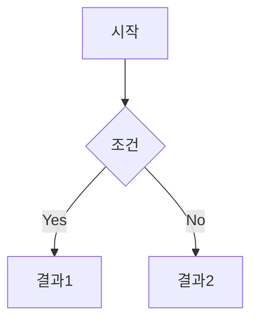
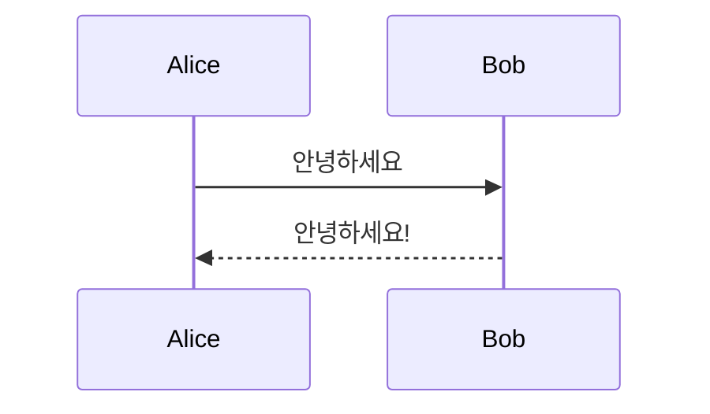

# 마크다운 레퍼런스

---

## 헤딩

```
# 제목1
## 제목2
### 제목3
#### 제목4
##### 제목5
###### 제목6
```

# 제목1입니다

## 제목2입니다
### 제목3입니다
#### 제목4입니다
##### 제목5입니다
###### 제목6입니다

기본폰트

---

## 텍스트 스타일

```
**굵게 (Bold)**
*기울임 (Italic)*
***굵게 + 기울임***
~~취소선 (Strikethrough)~~
==하이라이트 (Highlight)==
`인라인 코드`
```

**굵게 (Bold)**

*기울임 (Italic)*

***굵게 + 기울임***

~~취소선 (Strikethrough)~~

==하이라이트 (Highlight)==

`인라인 코드`
`this`
`인라인코드`


---

## 리스트

### 순서 없는 리스트

```
- 항목 1
- 항목 2
	- 하위 항목 2-1
	- 하위 항목 2-2
		- 하위 항목 2-2-1
- 항목 3
```

- 항목 1
- 항목 2
	- 하위 항목 2-1
	- 하위 항목 2-2
		- 하위 항목 2-2-1
- 항목 3

- 리스트


### 순서 있는 리스트

```
1. 첫 번째
2. 두 번째
	1. 하위 첫 번째
	2. 하위 두 번째
3. 세 번째
```

1. 첫 번째
2. 두 번째
	1. 하위 첫 번째
	2. 하위 두 번째
3. 세 번째

### 체크리스트

```
- [ ] 할 일 1
- [x] 완료된 할 일
- [ ] 할 일 2
```

- [ ] 할 일 1
- [x] 완료된 할 일
- [ ] 할 일 2

---

## 인용문

```
> 인용문입니다.
> 여러 줄도 가능합니다.

> 중첩 인용문
>> 두 번째 레벨
>>> 세 번째 레벨
```

> 인용문입니다.
> 여러 줄도 가능합니다.

> 중첩 인용문
>> 두 번째 레벨
>>> 세 번째 레벨

---

## 코드 블록

````
```python
def hello():
    print("Hello, World!")
```
````

```python
def hello():
    print("Hello, World!")
```

````
```cpp
#include <iostream>
int main() {
    std::cout << "Hello" << std::endl;
    return 0;
}
```
````

```cpp
#include <iostream>
int main() {
    std::cout << "Hello" << std::endl;
    return 0;
}
```

---

## 링크

### 외부 링크

```
[구글](https://google.com)
```

[구글](https://google.com)

### 위키링크 (Obsidian)

```
[[ForNote]]
```

[[ForNote]]

### 표시 텍스트 변경

```
[[ForNote|다른 텍스트로 표시]]
```

[[ForNote|다른 텍스트로 표시]]

### 헤딩으로 링크

```
[[ForNote#섹션이름]]
```

[[ForNote#섹션이름]]

---

## 이미지

### 외부 이미지

```

```


### 로컬 이미지 (Obsidian)

```
![[이미지파일명.png]]
```

![[이미지파일명.png]]

### 크기 조절

```
![[이미지파일명.png|300]]
```

![[이미지파일명.png|300]]

---

## 테이블

```
| 헤더1 | 헤더2 | 헤더3 |
| ----- | :---: | ----: |
| 왼쪽정렬 | 가운데정렬 | 오른쪽정렬 |
| 내용1 | 내용2 | 내용3 |
```

| 헤더1  |  헤더2  |   헤더3 |
| ---- | :---: | ----: |
| 왼쪽정렬 | 가운데정렬 | 오른쪽정렬 |
| 내용1  |  내용2  |   내용3 |
| 내용4  |  내용5  |   내용6 |

---

## 수평선

```
---
***
___
```

위 내용

---

아래 내용

***

다른 스타일

___

또 다른 스타일

---

## Callout (Obsidian)

```
> [!note] 노트
> 기본 노트 callout입니다.

> [!tip] 팁
> [!warning] 경고
> [!danger] 위험
> [!info] 정보
> [!question] 질문
> [!success] 성공
> [!failure] 실패
> [!example] 예시
> [!quote] 인용
```

> [!note] 노트
> 기본 노트 callout입니다.

> [!tip] 팁
> 유용한 팁입니다.

> [!warning] 경고
> 주의가 필요합니다.

> [!danger] 위험
> 위험 경고입니다.

> [!info] 정보
> 정보 callout입니다.

> [!question] 질문
> 질문 callout입니다.

> [!success] 성공
> 성공 callout입니다.

> [!failure] 실패
> 실패 callout입니다.

> [!example] 예시
> 예시 callout입니다.

> [!quote] 인용
> 인용 callout입니다.

### 접기/펼치기

```
> [!note]+ 펼쳐진 상태 (기본)
> [!note]- 접힌 상태 (기본)
```

> [!note]+ 펼쳐진 상태 (기본)
> 내용이 보입니다.

> [!note]- 접힌 상태 (기본)
> 클릭하면 내용이 보입니다.

---

## 각주

```
이것은 각주가 있는 문장입니다.[^1]
또 다른 각주입니다.[^note]

[^1]: 첫 번째 각주 내용입니다.
[^note]: 이름이 있는 각주입니다.
```

이것은 각주가 있는 문장입니다.[^1]

또 다른 각주입니다.[^note]

[^1]: 첫 번째 각주 내용입니다.
[^note]: 이름이 있는 각주입니다.

---

## 수식 (LaTeX)

### 인라인 수식

```
문장 안에 $E = mc^2$ 수식을 넣을 수 있습니다.
```

문장 안에 $E = mc^2$ 수식을 넣을 수 있습니다.

### 블록 수식

```
$$
\frac{-b \pm \sqrt{b^2 - 4ac}}{2a}
$$
```

$$
\frac{-b \pm \sqrt{b^2 - 4ac}}{2a}
$$

```
$$
\sum_{i=1}^{n} i = \frac{n(n+1)}{2}
$$
```

$$
\sum_{i=1}^{n} i = \frac{n(n+1)}{2}
$$

---

## 임베드

### 노트 임베드

```
![[ForNote]]
```

![[ForNote]]

### 노트 일부 임베드

```
![[ForNote#특정섹션]]
```

![[ForNote#특정섹션]]

### PDF 임베드

```
![[문서.pdf]]
```

![[문서.pdf]]

### 유튜브 임베드

```
<iframe width="560" height="315" src="https://www.youtube.com/embed/VIDEO_ID" frameborder="0" allowfullscreen></iframe>
```

<iframe width="560" height="315" src="https://www.youtube.com/embed/VIDEO_ID" frameborder="0" allowfullscreen></iframe>

---

## 주석

```
이 문장에는 보이지 않는 주석이 있습니다. %%이것은 주석입니다%%

%%
여러 줄 주석도
가능합니다.
%%
```

이 문장에는 보이지 않는 주석이 있습니다. %%이것은 주석입니다%%

%%
여러 줄 주석도
가능합니다.
%%

---

## 태그

```
#태그1 #태그2 #폴더/하위태그
```

#태그1 #태그2 #폴더/하위태그

---

## Mermaid 다이어그램

````

````


````

````


---
