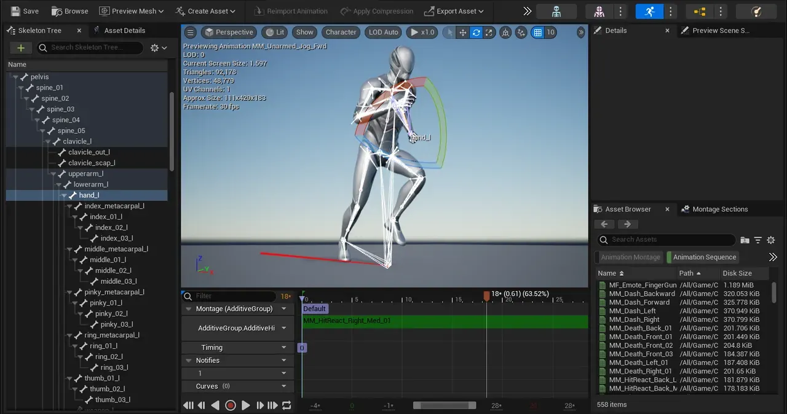
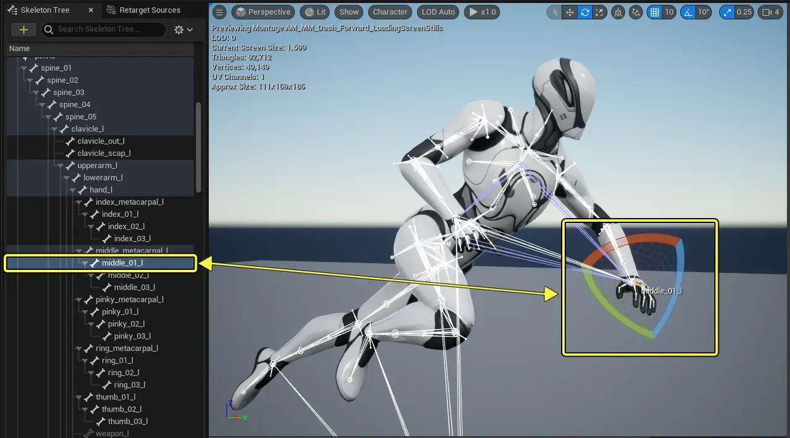
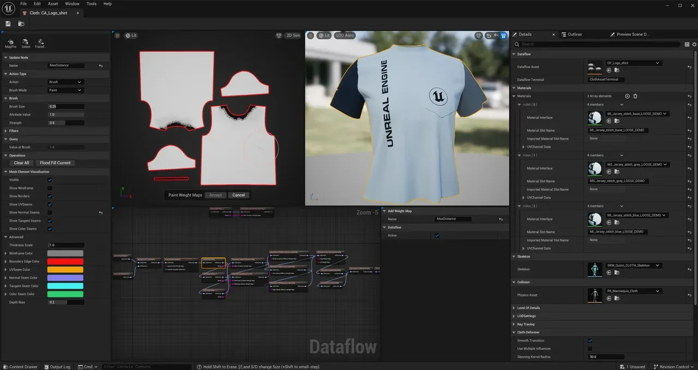

# Motion Matching, Unreal Animation Framework (UAF)

언리얼의 모션 기술에 대해 알아봅시다. 모션이 사용되는 경우는 크게 세 종류로 나눠집니다.

첫 번째는 미리 **찍어둔** 모션을 재생만 하는 경우입니다. 영화나 게임의 컷씬이 이 방법을 이용합니다. 잘 보이도록 미리 카메라 연출을 하고 수정할 수 있습니다.

두 번째는 사람의 모션을 실시간으로 **캡쳐** 하는 경우입니다. 버튜버나 VR이 이 방법을 사용합니다. 카메라 연출이나 좋은 장면을 의도하기 쉽지 않지만, 대신 실시간입니다.

세 번째는 실시간으로 모션이 **생성** 되는 경우입니다. 실시간으로 반응하는 NPC나 플레이어가 이 방법을 사용합니다. 한정된 입력으로 자연스러운 모션과 상호작용을 구현해야 해서 어렵습니다.

이번에 살펴볼 내용은 **모션의 절차적 생성** 입니다. Rig의 기본적인 정의부터, Motion Matching, Unreal Animation Framework까지 차근차근 알아보겠습니다.

목표는 Witcher 4 데모가 어떻게 만들어졌는지 이해하는 것입니다.

실시간으로 두 캐릭터가 동기화된 상호작용 모션을 보여주고 다시 헤어집니다. 이 모션은 절차적으로 생성되었지만, 매우 높은 퀄리티를 보여주고 있습니다. 기존의 게임에서는 보기 힘든 형태의 동작임을 알 수 있습니다. (플레이어 캐릭터도 아니고 그냥 배경의 NPC입니다)

---

## Rig: Bone + Weight

모든 3D 애니메이션의 시작은 리깅(Rigging)입니다. 리깅은 찰흙처럼 정지해 있는 3D 모델(보통 '메시(Mesh)' 또는 '스킨(Skin)'이라 부름)에 움직일 수 있는 뼈대를 심고, 이 뼈대가 살(메시)을 자연스럽게 움직이도록 연결하는 전체 과정을 말합니다.

아무리 정교하게 모델링 된 캐릭터라도 리깅이 되어있지 않다면 단순한 디지털 조각상에 불과합니다. 리깅은 이 조각상에 생명을 불어넣어 애니메이션을 할 수 있는 '디지털 인형(Puppet)'으로 만드는 작업입니다.

이 과정은 크게 두 가지 핵심 요소로 나뉩니다.

### 1. Bone (본 / 스켈레톤)

**본(Bone)** 은 캐릭터를 움직이기 위해 내부에 심는 **뼈대(Skeleton)** 입니다. 관절(Joint)이라고도 부릅니다.

핵심은 **'계층 구조 (Hierarchy)'**:

본은 독립적으로 존재하는 것이 아니라, '부모-자식' 관계의 계층 구조로 엄격하게 연결됩니다. 이는 실제 생물의 뼈대와 같습니다.

- `골반(Root)` 본이 부모가 됩니다.
- `어깨` 본은 `골반`의 자식입니다.
- `팔꿈치` 본은 `어깨`의 자식입니다.
- `손목` 본은 `팔꿈치`의 자식입니다.

이 계층 구조 때문에, 부모인 **`어깨`를 회전시키면 자식인 `팔꿈치`와 `손목`이 자동으로 함께 따라 움직입니다.** 이것이 모든 뼈대 애니메이션의 가장 근본적인 원리입니다.

### 2. Weight (웨이트 / 스키닝)

뼈대를 심었다고 해서 메시가 바로 따라 움직이지는 않습니다. 뼈(Bone)와 살(Mesh)을 연결해 주는 작업이 필요한데, 이를 스키닝(Skinning) 또는 **웨이트 페인팅(Weight Painting)** 이라고 합니다.

**'영향력'을 할당하는 과정:**

웨이트는 3D 모델의 표면을 구성하는 수많은 정점(Vertex) 각각에 대해, **'어떤 본에 의해 얼마나 많은 영향을 받을지'** 를 숫자로 정의하는 값입니다. 이 영향력의 총합은 항상 1(100%)이 됩니다.

**예시 (팔꿈치):**

- 팔꿈치 관절 부분의 한 정점은 `어깨` 본(부모)과 `팔꿈치` 본(자식)의 중간에 있습니다.
- 이 정점에 '어깨 본 영향력 50%, 팔꿈치 본 영향력 50%'라고 웨이트 값을 할당하면, 두 뼈가 움직일 때 그 정점은 두 움직임의 중간 지점으로 부드럽게 이동합니다.
- 만약 '어깨 본 100%'로 설정하면, 팔꿈치를 굽혀도 이 정점은 어깨를 따라가며 로봇처럼 각지게 꺾일 것입니다.

리깅이란, 모델에 **계층 구조를 가진 뼈(Bone)** 를 만들고, 이 뼈가 메시의 각 정점에 얼마나 영향을 미칠지 **웨이트(Weight)** 를 설정하여, 모델이 자연스럽게 변형(Deform)되며 움직일 수 있도록 준비하는 전체 과정입니다.

이렇게 뼈대와 웨이트 설정이 완료된 '리그(Rig)'가 준비되어야, 비로소 우리는 이 뼈대를 어떻게 '제어'할 것인지에 대한 다음 단계로 넘어갈 수 있습니다. 그리고 그 가장 첫 번째이자 기본적인 제어 방식이 바로 **순방향 운동학(FK)** 입니다.

---

## Forward Kinematics (FK)

FK는 '순방향'이라는 이름처럼, 뼈대(Bone)의 계층 구조를 따라 **부모에서 자식 순서** 로 움직임을 제어하는 가장 기본적이고 직관적인 방식입니다.

### 1. 정확한 작동 방식

컴퓨터 그래픽스에서 스켈레톤은 '부모-자식' 관계의 계층 구조(Hierarchy)로 이루어져 있습니다. 예를 들어, `어깨` (부모) -> `팔꿈치` (자식) -> `손목` (손자) 순입니다.

FK 방식에서는 항상 부모가 자식을 이끕니다.

a) 애니메이터가 `**어깨**` 본을 회전시킵니다.
b) `어깨`에 연결된 자식인 `**팔꿈치**`와 `손목`이 `어깨`의 움직임을 그대로 따라갑니다.
c) 그다음 애니메이터가 `**팔꿈치**`를 회전시킵니다.
d) `팔꿈치`의 자식인 `**손목**`이 `어깨`의 회전 값 + `팔꿈치`의 회전 값을 모두 더한 움직임을 따라갑니다.

이처럼 애니메이션 데이터가 뼈대 체인(Chain)의 **루트(Root)에서 끝(End)** 으로 순차적으로 전달된다고 해서 '순방향(Forward)' 운동학입니다.

### 2. 언리얼 엔진에서의 구현

언리얼 엔진의 모든 **애니메이션 시퀀스( `UAnimSequence`)** 의 기본 데이터가 바로 FK입니다.

- 애니메이션 시퀀스 애셋을 열어보면 타임라인에 따라 각 본(Bone)의 트랜스폼(주로 회전값)이 키프레임으로 저장되어 있습니다.
- 애니메이션 블루프린트(AnimBP)에서 `Output Pose`로 연결되는 모든 애니메이션 데이터는 기본적으로 이 FK 데이터가 재생되는 것입니다.

---

## Inverse Kinematics (IK)

### 1. FK의 한계점

FK는 팔을 휘두르거나 꼬리를 흔드는 등, **호를 그리는(Arc-based) 움직임**에는 매우 직관적입니다. 하지만 특정 목표 지점을 정확히 짚어야 할 때 치명적인 단점이 있습니다.

**문제**: 캐릭터의 `손`을 문고리 위치에 정확히 가져다 놓으려면 어떻게 해야 할까요? FK 방식으로는 `어깨`를 몇 도, `팔꿈치`를 몇 도 돌려야 할지 일일이 수동으로 계산하고 수정해야 합니다. 이는 매우 비직관적이고 시간이 오래 걸리는 작업입니다.

**핵심 한계:** 뼈대 체인의 끝부분(End-Effector)을 특정 좌표에 고정(Pinning)하기가 극도로 어렵습니다.

### 2. IK의 해결 방안

IK는 '역방향'이라는 이름처럼, FK와 정반대로 작동합니다. 뼈대 체인의 **끝부분(End-Effector)** 을 먼저 지정하면, 시스템이 중간 관절들의 회전 값을 자동으로 계산하여 뼈대 체인의 루트(Root) 방향으로 거슬러 올라가며 포즈를 만듭니다.

### 3. 정확한 작동 방식

**a) 구성 요소:**

- **IK 체인**: IK를 적용할 뼈대 범위 (예: `어깨`부터 `손목`까지)
- **엔드 이펙터 (End-Effector)**: 체인의 끝. 우리가 제어하려는 대상 (예: `손목`)
- **IK 골 (Goal / Target)**: 엔드 이펙터가 도달해야 할 목표 위치 (예: `문고리`의 3D 좌표)
- **IK 솔버 (Solver)**: 이 모든 것을 계산하는 알고리즘.

**b) 계산:** 애니메이터가 `IK 골`을 움직이면, `IK 솔버`가 실시간으로 "엔드 이펙터(`손목`)를 이 골 위치에 도달시키려면 `어깨`와 `팔꿈치`가 몇 도로 회전해야 하는가?"라는 방정식을 풉니다.

**c) 폴 벡터 (Pole Vector):** IK의 유일한 문제는 '모호성'입니다. `손`이 특정 지점을 향할 때, `팔꿈치`가 위로 꺾일 수도, 아래로 꺾일 수도 있습니다 (사람의 무릎은 뒤로만 꺾여야 함). 폴 벡터는 이 모호성을 해결해주는 '힌트'입니다. `팔꿈치`나 `무릎` 같은 중간 관절이 **항상 바라봐야 할 방향** 을 지정해주는 별도의 컨트롤러(또는 좌표)입니다.

### 4. 언리얼 엔진에서의 구현

IK는 주로 **애니메이션 블루프린트(AnimBP)** 의 '애님 그래프(Anim Graph)'에서 절차적(Procedural)으로 구현됩니다.

**주요 노드:**

- **Two-Bone IK:** 가장 보편적인 노드. 팔, 다리처럼 2개의 뼈로 구성된 관절(예: `어깨`-`팔꿈치`-`손목` 또는 `허벅지`-`정강이`-`발`)에 사용됩니다. `발`을 엔드 이펙터로, 땅바닥의 위치를 'IK 골'로 사용하여 울퉁불퉁한 지형에서도 발이 땅에 딱 붙게(Foot Planting) 만듭니다.
- **FABRIK (Forward And Backward Reaching Inverse Kinematics):** 뼈 개수에 상관없이 여러 관절로 이루어진 체인(예: 척추, 꼬리, 촉수)에 유용한, 더 유연하고 성능이 좋은 IK 솔버입니다.

---

## Control Rig

### 1. FK와 IK의 한계점

FK와 IK는 강력한 '방식'이지만, 그 자체로는 애니메이터에게 친절한 '도구'가 아닙니다.

- **문제 1 (복잡성):** 실제 캐릭터 리그는 수백 개의 뼈로 이루어져 있습니다. 애니메이터가 매번 'L_Clavicle_01', 'L_UpperArm_02' 같은 뼈를 직접 선택하고, FK/IK 솔버를 수동으로 설정하는 것은 매우 비효율적입니다.
- **문제 2 (워크플로우):** 전통적으로 이런 '리깅(Rigging)' 작업은 Maya나 Blender 같은 외부 DCC 툴에서만 가능했습니다. 언리얼 엔진은 완성된 애니메이션을 '재생'하는 곳이었지, '제작'하는 곳이 아니었습니다.
- **핵심 한계:** FK와 IK라는 **저수준(Low-level)의 방식** 을 애니메이터가 사용하기 쉬운 **고수준(High-level) 의 인터페이스** 로 추상화하고 통합할 표준화된 방법이 엔진 내부에 없었습니다.

### 2. 컨트롤 릭의 해결 방안

**컨트롤 릭(Control Rig)** 은 스켈레톤의 복잡한 뼈 구조 위에 **애니메이터를 위한 조작계(Interface)** 를 한 층 더 씌운 것입니다. 이는 동시에 언리얼 엔진 내부에서 직접 애니메이션을 '제작(Authoring)'하고 '수정'할 수 있게 해주는 강력한 노드 기반 시스템입니다.

### 3. 정확한 작동 방식

컨트롤 릭은 '뼈(Bone)'를 직접 조작하는 대신, '컨트롤러(Controller)'라는 가상의 제어점을 조작합니다.

**a) 추상화:** 애니메이터는 더 이상 뼈를 보지 않습니다. 대신 손 위치에 있는 `원(Circle) 모양 컨트롤러`, 발 위치에 있는 `박스(Box) 모양 컨트롤러`만 선택하고 움직입니다.

**b) 로직 내장:** 이 `컨트롤러` 내부에는 복잡한 로직이 숨겨져 있습니다.

- `발 컨트롤러`를 움직이면, 내부적으로는 해당 위치를 `IK 골`로 삼는 **IK 솔버** 가 자동으로 작동하여 다리뼈들(`허벅지`, `정강이`)의 회전 값을 계산합니다.
- `팔 컨트롤러`에는 **FK/IK 전환 스위치** 가 달려있어서, 애니메이터가 슬라이더 하나로 FK 모드(팔 휘두르기)와 IK 모드(벽 짚기)를 실시간으로 오갈 수 있습니다.

**c) 계층 구조:** 컨트롤러들끼리도 부모-자식 관계를 가질 수 있습니다. 예를 들어, `손가락 컨트롤러`들은 `손 컨트롤러`의 자식이 되어 함께 움직입니다.

### 4. 언리얼 엔진에서의 구현

언리얼 엔진 5의 **컨트롤 릭(Control Rig)** 은 플러그인으로 제공되는 고유한 시스템입니다.

- **노드 기반 그래프:** 블루프린트와 유사한 비주얼 스크립팅 환경을 제공합니다. 여기서 `컨트롤러`를 생성하고, `Get Bone Transform`, `Set Bone Transform`, `FABRIK` IK 노드 등을 연결하여 리깅 로직을 구축합니다.
- **주요 사용처 1 (애니메이션 제작): 시퀀서(Sequencer)** 에서 컨트롤 릭을 활성화하여, 마치 Maya처럼 언리얼 엔진 레벨 안에서 직접 캐릭터의 포즈를 잡고 키프레임 애니메이션을 제작(Authoring)할 수 있습니다.
- **주요 사용처 2 (절차적 애니메이션): 애니메이션 블루프린트** 에서 `Control Rig` 노드로 실행할 수 있습니다. 이는 기존의 `Two-Bone IK` 노드를 완벽하게 대체합니다. 예를 들어, '지형에 따라 발을 맞추고, 발 위치에 따라 골반의 높낮이도 조절하며, 시선 방향에 따라 척추를 살짝 비트는' 복잡한 절차적 애니메이션 로직을 하나의 컨트롤 릭 그래프로 깔끔하게 구현할 수 있습니다.

---

## Physics Based: Chaos

### 1. 컨트롤 릭 (FK/IK)의 한계점

컨트롤 릭은 애니메이터에게 '**완벽한 통제권**'을 줍니다. 이는 운동학(Kinematics, 힘을 고려하지 않는 움직임)의 정점입니다. 하지만 세상 모든 움직임을 애니메이터가 통제해야 할까요?

**문제:** 캐릭터가 갑자기 멈춰 설 때, 그의 망토 자락이나 긴 머리카락, 혹은 허리에 찬 체인의 움직임을 생각해 보십시오. 이 수백 개의 망토 주름과 머리카락 한 올, 체인 링크 하나하나를 애니메이터가 컨트롤 릭으로 '직접' 키프레임을 잡는 것은 불가능하며, 사실적이지도 않습니다.

**핵심 한계:** 컨트롤 릭은 **'의도된' 움직임** 에는 완벽하지만, 캐릭터의 움직임이나 외부 힘(바람, 중력)에 '반응하는' **2차적인(Secondary)** 움직임을 자동으로 생성하지 못합니다.

### 2. 카오스 물리의 해결 방안

**카오스 물리(Chaos Physics)** 는 **동역학(Dynamics)** 기반의 접근 방식입니다. 애니메이터가 움직임의 '결과(포즈)'를 직접 만드는 대신, 오브젝트의 **'물리적 속성(규칙)'** (예: 질량, 뻣뻣함, 마찰력)을 정의하고, 물리 엔진이 '결과(움직임)'를 **실시간으로 시뮬레이션(계산)** 하도록 맡깁니다.

### 3. 정확한 작동 방식 (카오스 옷)

**a) 질점-스프링 모델:** 카오스 옷(Chaos Cloth)은 3D 메시를 '뼈'가 아닌, 수많은 **'질점(Particle, 질량을 가짐)'** 과 이들을 연결하는 **'스프링(Spring, 제약조건)'** 의 집합으로 봅니다.

**b) 속성 정의:** 애니메이터는 이 스프링의 속성을 조절하여 재질을 결정합니다.

- **Stretch(신축) 강도**: 얼마나 잘 늘어나는가 (청바지 vs. 스판덱스)
- **Bend(굽힘) 강도**: 얼마나 뻣뻣한가 (가죽 vs. 실크)

**c) 시뮬레이션:** 게임이 실행되면, 카오스 엔진은 매 프레임마다 중력, 바람, 그리고 캐릭터 본체의 움직임(이것이 '충돌체' 역할을 함)을 받아 이 질점들에 적용합니다. 그리고 스프링 제약조건을 풀어서(Solve) 각 질점의 다음 위치를 계산합니다.

**d) 웨이트 페인팅 (고정):** 컨트롤 릭의 웨이트(스키닝)와는 다릅니다. 카오스 옷의 웨이트 페인팅은 **"어느 부분이 시뮬레이션에서 제외될지(고정될지)"** 를 정의합니다. (예: 셔츠의 어깨선이나 바지의 허리띠 부분은 물리 시뮬레이션 없이 캐릭터 뼈를 그대로 따라가야 함)

### 4. 언리얼 엔진에서의 구현

**Chaos Cloth:**

- 스켈레탈 메시 에디터 내에서 특정 머티리얼 슬롯에 **'클로스 데이터(Cloth Data)'** 를 생성하여 적용합니다.
- **데이터플로우(Dataflow) 그래프** 라는 새로운 노드 기반 에디터를 사용하여 천의 물리 속성을 매우 세밀하게 설정하고, 웨이트 맵을 칠하는 등의 작업을 비파괴적으로 관리합니다.

**Chaos Hair (Groom):**

- 수십만 가닥의 머리카락(Render Strands)을 모두 시뮬레이션하는 것은 불가능합니다.
- 대신, 눈에 보이지 않는 소수의 **'가이드 가닥(Guide Strands)'** 만을 물리 시뮬레이션합니다.
- 나머지 수많은 '렌더 가닥'들은 주변 '가이드 가닥'의 움직임을 참조하여 보간(Interpolation)된 움직임을 따라가며 매우 사실적인 흩날림을 표현합니다.

---

## Motion from Motion

이전의 FK/IK/컨트롤 릭이 '무'에서 움직임을 '창조'하는 방식이고, 카오스가 '물리 법칙'으로 움직임을 '계산'하는 방식이었다면, 지금부터 다룰 기법들은 **이미 존재하는 고품질의 모션 캡처(MoCap) 데이터를 '활용'** 하는 방식입니다.

**데이터 기반 애니메이션의 핵심 장점**

우리가 이 기법들을 사용하는 이유는 명확합니다.

**1. 압도적인 사실감 (High Fidelity):** 실제 전문 배우나 운동선수의 움직임을 캡처한 모션 데이터는, 애니메이터가 손으로(컨트롤 릭) 만들거나 물리(카오스)로 계산하는 것보다 훨씬 더 **미묘한 뉘앙스, 무게 중심 이동, 예비 동작, 후속 동작** 을 담고 있습니다.

**2. 제작 효율성:** "3초간 달리기" 모션을 컨트롤 릭으로 0부터 만드는 것보다, 캡처 스튜디오에서 3초간 달리는 것을 녹화하는 것이 훨씬 빠르고 품질이 높습니다.

하지만 이 방식은 새로운 치명적인 문제를 야기합니다.

"캡처된 100개의 애니메이션 클립을 어떻게 '이질감 없이' 연결해서, 플레이어의 '즉각적인' 조작에 '지연 없이' 반응하게 만들 것인가?"

이 문제를 해결하기 위한 기술이 바로 모션 블렌딩, 모션 매칭, 모션 워핑입니다.

---

## Motion Blending

모션 블렌딩은 데이터 기반 애니메이션의 가장 고전적이고 기본적인 해결책입니다. 이름 그대로, 두 개 이상의 애니메이션 클립을 '**혼합(Blend)**'하여 그 사이의 중간 포즈를 만들어내는 기술입니다.

### 1. 정확한 작동 방식

애니메이션은 결국 '시간에 따른 뼈(Bone)의 트랜스폼(위치, 회전, 스케일) 값'입니다. 모션 블렌딩은 두 애니메이션 클립(A, B)의 '**동일한 뼈**'에 대해 '**가중 평균(Weighted Average)**'을 계산합니다.

**예시 :** "걷기(Walk)" 클립과 "달리기(Run)" 클립을 50%씩 블렌딩한다면,

- `최종 어깨 회전 = (걷기 어깨 회전 * 0.5) + (달리기 어깨 회전 * 0.5)`
- `최종 다리 위치 = (걷기 다리 위치 * 0.5) + (달리기 다리 위치 * 0.5)`
- 이 계산을 모든 뼈에 대해 매 프레임 수행합니다.

### 2. 언리얼 엔진에서의 구현

언리얼에서 모션 블렌딩은 **애니메이션 블루프린트(AnimBP)** 의 심장과도 같습니다.

**블렌드 스페이스 (Blend Space):**

가장 대표적인 구현체입니다. 2D 그리드(격자)에 여러 애니메이션을 배치하고, 두 개의 입력 값(예: `속도`와 `방향`)에 따라 주변 애니메이션들을 실시간으로 블렌딩합니다.

- Y축에 `속도` (0 = Idle, 200 = Walk, 600 = Run)
- X축에 `방향` (-180 = 뒤, -90 = 왼, 0 = 앞, 90 = 오)
- 플레이어가 '대각선 앞(방향 45)으로 천천히 뛸(속도 400)' 때, 블렌드 스페이스는 "Walk_Fwd", "Run_Fwd", "Walk_Right", "Run_Right" 4개의 애니메이션을 적절한 비율로 섞어 **"대각선 앞 조깅"** 이라는, 존재하지 않던 애니메이션을 실시간으로 생성합니다.

**기타 블렌드 노드:** `Blend Poses by bool`, `Blend Poses by int` 등 상태 변경 시(예: IsFalling? `true`로 변경) 지정된 시간(예: 0.2초) 동안 부드럽게 한 포즈에서 다른 포즈로 블렌딩합니다.

### 3. 모션 블렌딩의 한계점

블렌딩은 간단하고 강력하지만, 두 가지 고질적인 문제가 있습니다.

**1. 발 미끄러짐 (Foot Sliding):** "달리기"와 "멈추기"처럼 발의 속도나 위치가 전혀 다른 두 애니메이션을 섞으면, 발이 땅에 고정되지 못하고 바닥을 스케이트처럼 미끄러지는 현상이 발생합니다.

**2. '흐리멍덩한' 움직임 (Mushy/Generic Poses):** 블렌딩은 'A와 B의 중간'을 만들 뿐, '새로운 C'를 만들지 못합니다. "A 공격"과 "B 공격"을 섞으면 강력한 "C 공격"이 나오는 게 아니라, 이도 저도 아닌 힘 빠진 '흐리멍덩한' 동작이 나옵니다.

**3. '상태 기계 지옥' (State Machine Hell):** 애니메이터가 모든 전환 규칙을 수동으로 정의해야 합니다. (Idle -> Walk, Walk -> Run, Run -> Stop, Run -> Jump, Idle -> Jump...). 애니메이션이 수백 개가 되면 이 '상태 기계(State Machine)'는 누구도 관리할 수 없는 스파게티 괴물이 됩니다.

---

## Motion Matching

### 1. 모션 매칭의 해결 방안

모션 매칭은 모션 블렌딩의 **'상태 기계 지옥'** 과 **'발 미끄러짐'** 문제를 정면으로 돌파하기 위해 고안된, 훨씬 진보된 데이터 기반 기술입니다.

**핵심 아이디어:**

"블렌딩(평균값)을 하지 말자. 상태 기계도 만들지 말자. 대신, **방대한 모션 데이터베이스** 를 매 프레임 초고속으로 검색하자. 그리고 지금 내 캐릭터의 **'현재 포즈'** 와 플레이어가 **'미래에 가고자 하는 방향'** 이 두 가지 조건에 가장 잘 **'일치(Match)'** 하는 '실제(Real)' 애니메이션 프레임을 찾아서, 그 지점부터 즉시 재생하자."

이 방식은 애니메이터가 수동으로 '전환(Transition)' 규칙을 만드는 대신, 시스템이 '검색(Search)'을 통해 최적의 전환을 스스로 찾아내게 만듭니다.

### 2. 정확한 작동 원리

모션 매칭은 크게 **(1) 데이터 준비(Bake)** 단계와 **(2) 런타임(Search)** 단계로 나뉩니다.

**(a) 데이터 준비 (Bake Time - '데이터베이스' 구축)**

**1. 모션 데이터 준비:** "Idle_to_Run", "Run_Stop"처럼 잘게 자른 클립이 아니라, 배우가 몇 분 동안 자유롭게 뛰고, 멈추고, 돌고, 걷는 등의 길고 **연속적인(Continuous) 모션 데이터** 를 대량으로 준비합니다. (예: 30분 분량의 달리기/걷기/방향전환 모션)

**2. '특징 벡터 (Feature Vector)' 추출:** 데이터베이스의 *모든* 프레임(수백만 개)에 대해 일종의 '인덱스(Index)' 또는 '꼬리표'를 만듭니다. 이 꼬리표가 바로 **'특징 벡터'** 이며, 현재 프레임의 '상태'를 요약합니다.

**3. 특징 벡터 구성:** 이 벡터에는 "현재 포즈"와 "미래 궤적" 정보가 모두 포함됩니다.

- 현재 포즈 (Current Pose):
    - 양쪽 발의 **루트(골반) 기준 상대 위치 및 속도**
    - 양쪽 손의 **루트 기준 상대 위치 및 속도** (선택 사항)
    - 루트(골반)의 **속도 (Velocity) 및 각속도** (Angular Velocity)
- 미래 궤적 (Future Trajectory):
    - **"이 프레임부터 애니메이션을 계속 재생한다면, 0.5초 뒤, 1.0초 뒤, 1.5초 뒤에 캐릭터의 루트가 어디에 있을 것인가?"** 에 대한 2D (X, Y) 좌표 및 방향.

이제 데이터베이스의 모든 프레임은 `[현재 발 위치, 현재 손 속도, ..., 1.5초 뒤 미래 위치]`라는 고유한 '특징 벡터' 꼬리표를 갖게 되며, 이는 K-d tree 같은 자료구조로 인덱싱되어 초고속 검색이 가능하도록 준비됩니다.

**(b) 런타임 (Real-Time - '검색과 선택')**

매 프레임마다 다음 과정이 실시간으로 반복됩니다.

**1) 요청 생성 (Player Input):**
- 플레이어가 컨트롤러 스틱을 '왼쪽 45도'로 '최대'로 기울입니다.
- 시스템은 이 입력을 바탕으로 **"플레이어가 원하는 미래 궤적 (Desired Trajectory)"** 을 생성합니다. (예: "앞으로 1초 뒤 5미터, 왼쪽 45도 방향")

**2) 현재 상태 생성 (Current Character):**
- 캐릭터의 **'현재 포즈 특징 벡터'** 를 계산합니다. (현재 발 위치, 속도 등)

**3) Chooser를 통한 DB 선택 (Database Selection):**
- 캐릭터가 할 수 있는 모든 동작(걷기, 달리기, 전투, 수영, 등반...)을 단 하나의 거대한 데이터베이스에 넣고 검색하는 것은 매우 비효율적입니다.

**'Chooser(선택자)'** 는 현재 캐릭터의 **'상태 태그(Tag)'** 나 **'게임플레이 이벤트'** 에 따라 검색할 데이터베이스 자체를 동적으로 선택하는 상위 시스템입니다.

**작동 예시:**
- 플레이어가 그냥 이동 중 -> `[Locomotion_DB]`를 검색
- 플레이어가 "전투 자세" 버튼을 누름 -> `[Combat_Locomotion_DB]` (무기를 들고 옆걸음질 치는 모션이 포함된 DB)를 검색
- 플레이어가 "회피" 버튼을 누름 -> `[Dodge_DB]` (회피 모션만 모아둔 DB)를 검색
- 이 'Chooser' 단계 덕분에, 시스템은 '전투 자세'에서 '회피'를 검색하는 등의 엉뚱한 검색을 하지 않고, 현재 상황에 맞는 가장 적절한 모션 풀(Pool) 안에서만 검색을 수행하여 효율과 정확성을 높입니다.

**4) 검색 및 비용 계산 (Search & Cost Function):**
- Chooser에 의해 선택된 DB(예: `Locomotion_DB`) 안에서, 시스템이 수십만 개의 프레임 꼬리표(특징 벡터)를 초고속으로 검색하며 "가장 저렴한(Best)" 프레임을 찾습니다.

**비용(Cost) =**
- `A (현재 캐릭터의 발 위치 - DB 프레임의 발 위치)`
- `+ B (현재 캐릭터의 속도 - DB 프레임의 속도)`
- `+ C (플레이어가 원하는 미래 궤적 - DB 프레임의 미래 궤적)`
- 여기서 A, B, C는 가중치입니다. '미래 궤적(C)'에 가장 높은 가중치를 두어 플레이어의 입력(가고 싶은 방향)에 가장 잘 반응하도록 설정합니다.

**5) 최적 프레임으로 '점프' (Jump):**
- 이 '비용'이 가장 낮은(가장 일치하는) 프레임을 데이터베이스에서 찾습니다.
- 예: "Run_and_Turn" 클립의 1245 프레임이 가장 저렴하다고 판단됨.
- 시스템은 **즉시 현재** 재생 중인 애니메이션을 버리고, "Run_and_Turn" 클립의 1245 프레임부터 재생을 시작합니다.

**6) 스티칭 및 블렌딩 (Stitching & Blending):**
- 아무리 '비용이 낮은' 프레임을 찾았다고 해도, 현재 프레임(A)과 새로 찾은 프레임(B)이 100% 동일할 수는 없습니다.
- 이 '점프'를 하는 순간, 미세한 포즈의 차이로 인해 캐릭터가 뚝 끊기는 **'팝(Pop)'** 현상이 발생할 수 있습니다.
- **'스티칭(Stitching)'** 은 이 '팝' 현상을 숨기기 위해, 점프가 일어나는 그 순간에 매우 짧은 시간(예: 0.1초 ~ 0.2초) 동안 **'관성 기반 블렌드(Inertial Blend)'** 를 수행하는 것을 의미합니다.
- 이전 애니메이션(A)의 관성(속도, 각속도)을 새로운 애니메이션(B)으로 부드럽게 넘겨주는 것입니다.
- **중요:** 모션 매칭은 이미 비용 계산을 통해 '가장 비슷한' 포즈를 찾았기 때문에, 이 블렌딩은 모션 블렌딩의 '흐리멍덩한' 블렌드와 달리 거의 눈에 띄지 않으면서 두 클립을 매끄럽게 '꿰매줍니다(Stitch)'.

### 3. 언리얼 엔진에서의 구현

언리얼 5는 **'모션 매칭(Motion Matching)'** 플러그인을 정식으로 지원하며, 이는 `Lyra` 샘플 프로젝트에서 핵심적으로 사용됩니다.

- `Motion Matching Database` 애셋에 모션 데이터를 베이크(Bake) 합니다.
- `Chooser Table` 애셋을 만들어 "전투 중", "이동 중" 같은 게임 플레이 태그(Tag)에 따라 어떤 DB를 사용할지 정의합니다.
- 애니메이션 블루프린트에서 거대한 `State Machine` 대신, 이 `Motion Matching` 노드와 `Chooser` 노드를 연결하여 훨씬 단순하고 반응성이 뛰어난 로직을 구현합니다.

### 4. 모션 매칭의 한계점

**a) 데이터 의존성 (Data Hungry):** 모션 매칭은 '발견'할 뿐, '창조'하지 못합니다. 만약 DB에 "2.5미터 점프" 모션이 없다면, 캐릭터는 절대 2.5미터를 뛸 수 없습니다. (2.3m나 2.7m 모션을 찾아 재생할 뿐)

**b) 정확한 상호작용의 한계:** "정확히 1.2미터 높이의 담벼락"을 넘거나, "정확히 내 앞 2.3미터 지점의 적"을 칼로 찌르는 것은 불가능합니다. DB에 모든 거리와 모든 높이의 모션을 넣을 수는 없기 때문입니다.

---

## Motion Warping

### 1. 모션 워핑의 해결 방안

**모션 워핑(Motion Warping)** 은 '일반적인' 모션 클립 하나를 가져와서, **'시간과 공간을 왜곡(Warp)'** 시켜 **'특정 목표 지점'** 에 정확하게 맞추는 기술입니다.

**핵심 아이디어:**
"애니메이션 클립 자체는 그대로 두되, 애니메이션의 루트 모션(Root Motion) 속도와 **재생 시간(Play Rate)** 을 동적으로 조절하여, 애니메이션의 '핵심 부분(예: 손 짚기, 발 착지)'이 내가 원하는 목표 지점(Target)에 정확히 도달하도록 만들자."

### 2. 루트 모션 워핑 (Root Motion Warping / Space Warping)

"애니메이션의 '속도(Play Rate)'는 그대로 둔 채, **'이동 거리(Root Motion)'만 늘리거나 줄여서 정확한 '위치'에 도달** 하게 만드는 기술"입니다. 이것이 '모션 워핑'이라고 할 때 가장 일반적으로 사용되는 방식입니다.

**(a) 자주 쓰이는 케이스 (목표: 위치 동기화)**
- **볼팅 (Vaulting) / 담벼락 넘기:** 1.0m 폭의 담벼락이든 1.2m 폭의 담벼락이든, *단 하나의* 담벼락 넘기 애니메이션으로 정확히 손을 짚고 정확히 반대편에 착지해야 할 때.
- **절벽/선반 잡기 (Ledge Grabbing):** 점프 높이가 살짝 모자라거나 넘칠 때, 손을 절벽 끝에 정확히 '붙여주며' 매달리는 동작.
- **근접 전투 (Finishing Moves, Takedowns):** 내 캐릭터와 적 캐릭터가 2.0m 떨어져 있든 2.5m 떨어져 있든, "마무리 일격" 버튼을 누르면 부드럽게 거리를 조절하며 달려가 정확한 위치에서 찌르기 모션이 실행되어야 할 때.

**(b) 정확한 작동 방식**
**1) 목표 지점 설정 (Warp Target):**
- 게임 로직(예: 레이 캐스트)이 넘어가야 할 담벼락의 시작과 끝 위치를 감지하여 '워프 타겟'으로 설정합니다.

**2) 동기화 지점 설정 (Sync Point):**
- 애니메이터가 '담벼락 넘기' 애니메이션 몽타주(Montage) 내부에 '동기화 지점(Notify)'을 미리 심어둡니다.
- 예: `Warp_Start` (손을 짚기 직전), `Warp_Land` (착지하는 프레임).

**3) 워핑 (Warping) 실행:**
- 플레이어가 담벼락 앞에서 '넘기' 버튼을 누릅니다.
- 모션 워핑 컴포넌트가 "현재 내 위치"와 "목표 지점(`Warp_Start`)" 사이의 실제 거리를 계산합니다.
- 이 '실제 거리'와 애니메이션에 저장된 '원본 루트 모션 거리'를 비교합니다.

**4) 결과:**
**- Case 1:** 목표가 원본보다 더 멀 때 (예: 원본 2.0m vs 실제 2.2m)
- 시스템은 애니메이션의 **루트 모션 스케일을 1.1배로 늘립니다.** (2.2 / 2.0 = 1.1)
- 캐릭터는 애니메이션 재생 시간(예: 1초) 동안 더 빠른 속도로 움직여 2.2m를 이동합니다.
- 애니메이션 자체의 '재생 속도(Play Rate)'는 1.0x로 유지됩니다. 손을 짚는 동작은 정상 속도지만, 그 동작을 수행하는 몸의 이동(루트 모션)만 빨라집니다.

**- Case 2:** 목표가 원본보다 더 가까울 때 (예: 원본 2.0m vs 실제 1.8m)
- 시스템은 애니메이션의 **루트 모션 스케일을 0.9배로 줄입니다.** (1.8 / 2.0 = 0.9)
- 캐릭터는 같은 1초 동안 더 느린 속도로 움직여 1.8m만 이동합니다.
- 마찬가지로, 애니메이션의 '재생 속도'는 1.0x입니다.

이처럼 **공간(Space)을 왜곡**시켜, 애니메이션 클립의 '동작'은 유지하되 '이동 거리'만 목표에 정확히 맞춥니다.

### 3. 타임 워핑 (Time Warping)

"애니메이션의 '이동 거리(Root Motion)'는 무시하고, **'재생 속도(Play Rate)' 자체를 빠르게 또는 느리게 조절하여, 특정 프레임이 정확한 '순간'에 재생**되도록 맞추는 기술"입니다. 이 방식은 '위치'가 아니라 '타이밍'이 중요할 때 사용됩니다.

**(a) 자주 쓰이는 케이스 (목표: 시간 동기화)**
- **패링 / 카운터 공격 (Parry / Counter):**
    - 적의 공격이 0.4초 뒤에 나에게 닿을 예정입니다.
    - 내 '패링' 애니메이션의 '방어 성공' 프레임은 0.5초(30프레임)에 있습니다.
    - 이대로라면 0.1초 늦게 방어해서 공격을 맞게 됩니다.
    - 타임 워핑이 작동하여, '패링' 애니메이션의 **재생 속도를 1.25배로 높입니다**. (0.5 / 0.4 = 1.25)
    - 그 결과, 내 '방어 성공' 프레임이 정확히 0.4초 뒤에 재생되어 적의 공격을 완벽하게 막아냅니다.
- **잡기 (Grabs):** 적에게 잡기 기술을 시도할 때, 적이 살짝 회피하는 모션(0.6초)을 재생했습니다. 내 잡기 애니메이션의 '손이 닿는' 프레임(0.5초)을 적의 회피가 끝나는 0.6초에 정확히 맞추기 위해, 내 애니메이션 속도를 0.83배로 *느리게* 워핑하여 타이밍을 맞출 수 있습니다.
- **협동 상호작용 (Co-op Interaction):** 두 플레이어가 동시에 버튼을 누르거나 악수하는 애니메이션을 재생할 때, 두 사람의 애니메이션 시작 시간이 달라도 '손이 맞닿는' 프레임을 동일한 순간에 재생되도록 재생 속도를 조절합니다.

**(b) 정확한 작동 방식**
**1) 목표 시간 설정 (Warp Target Time):** 게임 로직이 '이벤트가 발생해야 하는 정확한 시간' (예: 0.4초 뒤)을 계산합니다.

**2) 동기화 지점 설정 (Sync Point):** 애니메이터가 몽타주에 '핵심 이벤트 프레임' (예: 패링 성공 프레임)을 마킹합니다. 이 프레임의 원본 시간(예: 0.5초)을 시스템이 알고 있습니다.

**3) 워핑 (Warping) 실행:** 시스템이 '목표 시간'(0.4초)과 '원본 시간'(0.5초)의 차이를 계산합니다.

**4) 결과:** 애니메이션 전체의 재생 속도(Play Rate)를 '원본 시간 / 목표 시간' (0.5 / 0.4 = 1.25배)로 변경하여 몽타주를 재생합니다.

### 4. 언리얼 엔진에서의 구현

- 캐릭터 블루프린트에 `Motion Warping Component`를 추가합니다.
- 애니메이션 몽타주(Montage)에 `Add Motion Warp Window` 노티파이를 추가하고, `Warp Target Name` (예: "VaultTarget")을 지정합니다.

**루트 모션 워핑 (Space):**
- 캐릭터 BP에서 담벼락 위치를 계산한 뒤, `AddOrUpdateWarpTargetFromLocation` 노드를 호출하여 "VaultTarget"이라는 이름으로 해당 위치 좌표를 등록합니다.
- 이후 몽타주를 재생하면, 컴포넌트가 알아서 해당 노티파이 구간에서 등록된 "VaultTarget" 위치로 루트 모션을 왜곡합니다.

**타임 워핑 (Time):**
- `AddOrUpdateWarpTargetFromLocation` 대신, `AddOrUpdateWarpTargetFromProvider` 등을 사용하고 특정 타이밍 계산 로직을 바인딩하여 구현할 수 있습니다. (다소 더 복잡한 설정이 필요)

---

## Unreal Animation Framework (UAF)

### 1. 기존 기술(워핑, 매칭)의 한계점

모션 매칭과 모션 워핑은 한 캐릭터가 **환경** 이나 **목표 지점** 과 상호작용(담벼락 넘기, 적에게 접근하기)하는 데는 탁월했습니다. 하지만 **움직이는 다른 캐릭터** 와 픽셀 단위로 정확하게 상호작용하는 것은 거의 불가능했습니다.

**문제 (Takedown / 잡기 기술):**

**1. 시작 위치 문제:** 플레이어가 적 뒤에서 '잡기'를 시도합니다. `모션 워핑`을 사용해 플레이어가 적의 등 뒤 **특정 좌표** 까지는 접근할 수 있습니다.

**2. 동기화 문제:** 하지만 플레이어가 잡는 순간, 적 또한 '잡히는' 애니메이션을 **정확히 같은 타이밍** 에 재생해야 합니다.

**3. '분리' 문제:** 가장 심각한 문제입니다. 플레이어는 '잡기' 몽타주(루트 모션 포함)를, 적은 '잡히는' 몽타주(루트 모션 포함)를 각자 재생합니다. 두 애니메이션은 원래 하나의 세트로 제작되었지만, 미세한 오차나 물리 충돌, 지형의 작은 단차로 인해 **두 캐릭터가 분리되거나(Drift Apart)**, 한 명이 땅에 묻히거나, 손이 어깨를 뚫는(Clipping) 현상이 발생합니다.

**핵심 한계:** 두 개(이상)의 독립적인 스켈레탈 메시 액터가 **애니메이션이 재생되는 내내 완벽하게 동기화된 상태** 를 유지할 방법이 없었습니다.

### 2. UAF의 해결 방안

UAF는 이 문제를 해결하기 위해 "상호작용이 시작되면, 두 캐릭터를 **일시적으로 하나의 유닛(Unit)처럼 묶어버리자**"라는 아이디어를 제시합니다.

이는 단일 노드가 아니라, **모션 워핑, 컨트롤 릭(IK), 동적 부착(Attachment)** 기술을 유기적으로 결합한 '구현 방식의 약속(Framework)'입니다.

핵심은 상호작용에 참여하는 캐릭터들에게 **'역할(Role)'** 을 부여하는 것입니다.

- **주도자 (Lead)**: 상호작용을 시작하고 전체 움직임을 이끄는 캐릭터 (예: 잡기를 시도하는 플레이어)
- **추종자 (Follower)**: 상호작용에 반응하는 캐릭터 (예: 잡히는 적)

### 3. 정확한 작동 방식

"플레이어(주도자)가 적(추종자)을 뒤에서 잡아 넘어뜨린다"는 상호작용은 UAF에서 다음과 같은 4단계로 작동합니다.

**a) 접근 (Approach) - (모션 워핑)**
- 플레이어가 '잡기' 버튼을 누릅니다.
- 시스템은 적의 위치를 `Warp Target`으로 설정합니다.
- 플레이어는 **모션 워핑(Motion Warping)** 을 사용해 '잡기 준비' 애니메이션을 재생하며 적의 등 뒤로 정확하게 접근합니다. (여기까지는 이전 단계와 동일)

**b) 체결 (Engage) - (동적 부착 및 역할 할당)**
- 플레이어의 모션이 적에게 닿는 '동기화 지점(Sync Point)'에 도달합니다.
- UAF의 핵심입니다:

**1. 역할 할당:** 플레이어는 `주도자(Lead)`, 적은 `추종자(Follower)` 역할을 부여받습니다.

**2. 동적 부착 (Dynamic Attachment):** `추종자(적)`를 `주도자(플레이어)`의 **특정 본(Bone)** 이나 **소켓에 일시적으로 부착(Attach)** 시킵니다.

**3. 루트 모션 제어권 이양:**
- `주도자(플레이어)`는 '잡기' 애니메이션 몽타주를 재생합니다. 이 몽타주에는 **두 캐릭터가 함께 넘어지는 전체 루트 모션(Root Motion)** 이 포함되어 있습니다.
- `추종자(적)`는 '잡히는' 애니메이션 몽타주를 재생합니다. **단, 이 몽타주의 루트 모션은 0이거나 완전히 무시** 됩니다.

**결과:** 이제 `적`은 자신의 루트 모션으로 움직이는 것이 아니라, `플레이어`에게 '부착'된 상태로 **플레이어의 루트 모션** 을 그대로 따라가게 됩니다. 두 캐릭터는 물리적으로 분리될 수 없는 **하나의 애니메이션 유닛** 이 됩니다.

**c) 포즈 보정 (Pose Correction) - (IK / 컨트롤 릭)**
- 이제 두 캐릭터는 찰싹 붙어서 함께 움직이지만, 사소한 문제가 남아있습니다. `적`이 플레이어보다 키가 크거나 작으면 어떻게 될까요?
- 플레이어의 '잡는 손'은 허공을 짚거나, 적의 어깨를 파고들(Clipping) 것입니다.

**작동 방식:**
1. `주도자(플레이어)`의 애니메이션 블루프린트에서, **컨트롤 릭(Control Rig)** 이나 **IK 노드** 가 실시간으로 작동합니다.
2. 플레이어의 `왼손 컨트롤러`가 `추종자(적)`의 `어깨 소켓` 위치를 **실시간으로 추적(Targeting)** 하도록 설정합니다.
3. 적의 키가 크면 플레이어의 손이 IK에 의해 원본 애니메이션보다 더 위로 올라가 어깨를 짚고, 키가 작으면 손이 더 내려옵니다.

**결과:** 두 캐릭터가 함께 움직일 뿐만 아니라, 실시간 IK 보정을 통해 서로 다른 체형이나 미세한 위치 차이에도 불구하고 손과 몸이 항상 **정확하게 맞닿은 상태** 를 유지합니다. (이를 **애니메이션 워핑** (Animation Warping) 또는 **포즈 워핑** 이라고도 부릅니다.)

**d) 해제 (Disengage)**
- '잡기' 애니메이션 몽타주가 끝나는 지점에 도달합니다.
- `추종자(적)`와 `주도자(플레이어)` 간의 **동적 부착(Attachment)을 해제** 합니다.
- 두 캐릭터는 UAF 상태를 벗어나, 다시 각자의 일반적인 애니메이션 로직(예: 모션 매칭)으로 돌아가 '일어나는' 애니메이션 등을 재생합니다.

### 4. 요약

UAF는 **모션 워핑** 으로 상호작용을 시작하고, **동적 부착** 과 루트 **모션 제어권 이양(주도자/추종자)** 으로 두 캐릭터를 하나로 묶어 동기화 문제를 해결하며, **실시간 IK/컨트롤 릭** 으로 포즈를 보정하여 클리핑 문제를 해결하는, 다수 캐릭터 상호작용을 위한 완벽한 '종합 프레임워크'입니다.

---

#### 주요 레퍼런스

[https://dev.epicgames.com/documentation/ko-kr/unreal-engine/animating-characters-and-objects-in-unreal-engine](https://dev.epicgames.com/documentation/ko-kr/unreal-engine/animating-characters-and-objects-in-unreal-engine)

[https://youtu.be/tNw9lD2PW3U?si=c_tW3xK05liafnZX](https://youtu.be/tNw9lD2PW3U?si=c_tW3xK05liafnZX)

[https://youtu.be/FLDXtAV7qsw?si=TMJccKy4R-8lWbjY](https://youtu.be/FLDXtAV7qsw?si=TMJccKy4R-8lWbjY)

[https://youtu.be/MIhnv29csSQ?si=Se4TcCh9M6mTadKA](https://youtu.be/MIhnv29csSQ?si=Se4TcCh9M6mTadKA)

[https://youtu.be/kO6pz8ADgcU?si=D3miaEjIakrHTGcA](https://youtu.be/kO6pz8ADgcU?si=D3miaEjIakrHTGcA)

[https://youtu.be/v4slYkeuJmg?si=0Qfwmysc-bfathPm](https://youtu.be/v4slYkeuJmg?si=0Qfwmysc-bfathPm)

[www.youtube.com/@goatzawal](https://www.youtube.com/@goatzawal)
