# Unreal Engine 5: Nanite, Lumen

이번 글에서는 언리얼5로 넘어오면서 추가된 나나이트에 대해 알아보겠습니다.

---

## 1. Deferred Shader Rendering

저번 글에서 다룬 Deferred Shader Rendering은 Shader(Lighting)연산을 쪼개주면서 효율적 이득을 챙겼습니다. 즉, 화면에 보이는 물체의 표면만 재구성하여 G-Buffer를 만들고, G-Buffer에서 Shader 연산을 했습니다. 따라서 물체 개수에 비례하는 Shader 연산을 하지 않고, 화면의 픽셀에 비례하는 Shader 연산을 했습니다.

추가적으로 G-Buffer를 만드는 과정을 Depth PrePass와 Base Pass로 나누어, 표면이 겹치는 경우를 처리했습니다.

- **Depth PrePass**: 물체의 Vertex 정보만 써서 픽셀마다 제일 가까운 표면까지 거리를 표기해 Depth Map을 만듦
- **Base Pass**: Depth Map으로 화면 픽셀마다 어떤 물체가 제일 앞에 나와있는지 판단하여 G-Buffer 구성

하지만 문제점은 물체의 vertex가 중복으로 호출된다는 점입니다. 따라서 Unreal Engine 5에서는 새로운 파이프라인을 도입하게 됩니다.

---

## 2. Deferred Material Rendering

Depth Map을 넘겨주지 않고, Visibility Buffer를 넘겨주는 방식을 Deferred Material Rendering이라고 합니다. Visibility Buffer는 Depth, 삼각형 ID가 들어가게 됩니다. Vis-Buffer에서 물체를 호출하지 않고 바로 머티리얼에 접근할 수 있으므로, 더 효율적이게 됩니다.

또한 Deferred Shading은 Lighting을 쪼갰지만, 이제는 머티리얼을 찾는 과정까지 쪼갰으므로 Deferred Material이라고 합니다.

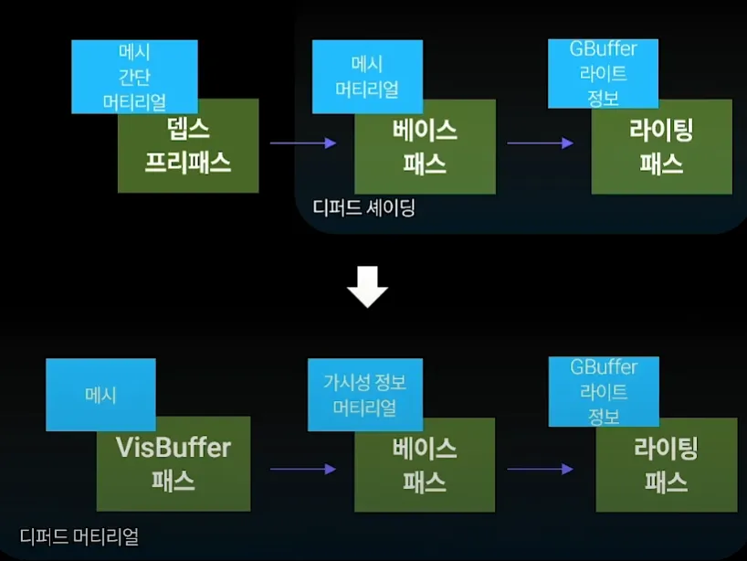

추가적으로, Vis-Buffer에는 Cluster ID가 들어갑니다. 이제부터 Cluster에 대해 설명하며 Vis-Buffer가 어떻게 만들어지는지 살펴보겠습니다.

---

## 3. Cluster LOD

Level of Detail(LOD)란, 렌더링 최적화 기술로, 먼 물체는 적은 폴리곤수의 메시로 치환하는 기술입니다.

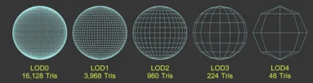

이 LOD를 자동으로 수행해주는 방식이 Nanite라고 볼 수 있겠습니다. 같은 물체라도 가까운 부분은 자세히, 먼 부분은 대충 묘사하는 과정이 실시간으로 이루어집니다. 그 비결은 Cluster라는 삼각형들의 묶음을 체계적으로 관리하는데 있습니다.

Cluster를 구성하기 위해서는 서로 다른 크기의 Cluster들이 있어야 합니다.

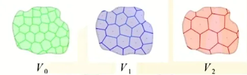

또한 다른 크기의 Cluster끼리 전환도 자연스럽게 이루어져야 합니다.

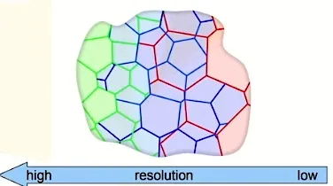

따라서 제일 작은 크기의 기본 Cluster (삼각형 128개)부터 묶으며 제일 큰 크기의 Cluster 그룹(물체 전체)까지 순차적으로 만들게 됩니다.

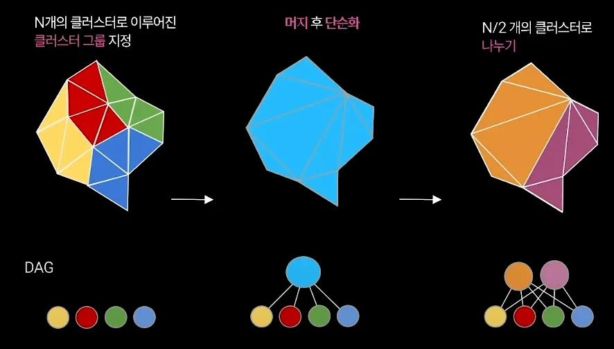

만드는 과정은 일단 클러스터를 다 합치고 새로 나누는 방식을 사용합니다. 이렇게 클러스터 그룹들의 계층구조를 만들면 트리 구조가 생기게 됩니다.

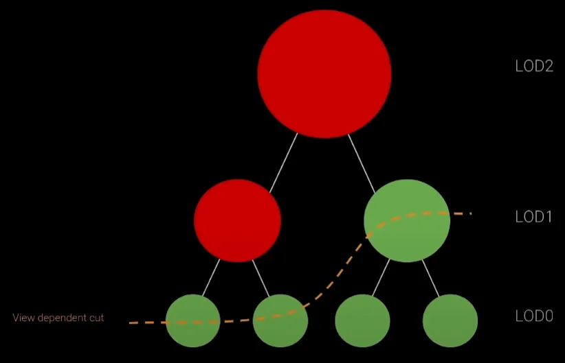

이 트리 구조는 미리 만들어두고, 렌더링에서는 실시간으로 필요한 클러스터 그룹 크기의 계층까지만 메모리에 넣어둡니다. 실시간으로 메모리에 보유하는 트리를 바꾸는 과정을 스트리밍이라고 합니다.

---

## 4. Cluster Culling

Occlusion Culling은 가려지는 물체를 제외해줍니다. Cluster Culling은 가려지는 Cluster를 제외합니다.

기존의 Base Pass에서는 Depth Map을 기준으로 픽셀마다 맨 앞에 보이는 삼각형을 찾았습니다. Cluster Culling에서도 Depth Map을 기준으로 맨 앞에 보이는 Cluster를 찾아줍니다. 하지만 픽셀마다 수행하지 않아서 Cluster의 크기가 중요해지며, 따라서 Depth Map을 해상도별로 필요합니다.

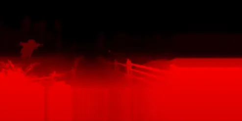

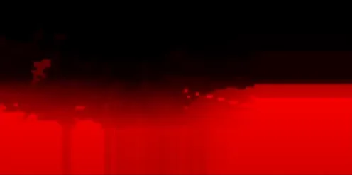

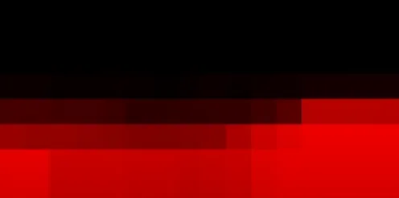

Depth Map(Z-Buffer)를 해상도를 절반씩 줄이며 구성한 계층을 Hierarchical Z-Buffer(HZB)라고 합니다. 각 계층의 픽셀에는 하위 계층 픽셀들의 가장 먼 깊이를 저장해줍니다. 그러면 Cluster마다 한 번에 맨 앞에 보이는지 여부를 판단할 수 있습니다.

방법은 Cluster의 크기만한 픽셀 크기를 가진 계층에서 깊이값을 가져와 비교하면 됩니다. 만약 더 크다면, 그 Cluster는 다른 객체(ex: 더 큰 Cluster)에 의해 가려진다는 의미이므로 제외할 수 있습니다.

---

## 5. Visibility Buffer

이제 드디어 Vis-Buffer를 만드는 과정입니다. 간단합니다. Cluster Culling 과정에서 추출된 화면에 보이는 Cluster로 만들면 됩니다.

하지만 최적화 기법이 하나 들어가면서 복잡해졌습니다. HZB를 처음부터 만드는 것은 물체의 Vertex를 참조해야 하므로 시간이 걸리는 작업입니다. 따라서 이전 프레임의 HZB을 새 프레임의 HZB를 만드는데 적극적으로 이용합니다.

우선 이전 프레임의 HZB로 먼저 Cluster Culling을 진행해줍니다. 추출된 Visible Cluster로 Rasterization을 거쳐 임시 HZB를 만들어줍니다. 탈락된 Occluded Cluster가 Visible Cluster 앞에 나타나는 경우가 가능하므로, 임시 HZB로 Cluster Culling을 진행해줍니다.

두 번째 Cluster Culling에서도 탈락되면 Visible Cluster 뒤에 있는 Cluster이므로 완전히 제외해줍니다. 두 번째 Cluster Culling에서 선택되면 임시 HZB보다 앞에 있는 Cluster이므로 Rasterization을 거쳐 최종 HZB에 반영합니다.

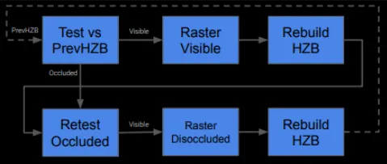

최종 HZB를 구하면서 Visibility Buffer도 구성하게 됩니다. 이 과정은 모두 GPU에서 진행되며, 기존에 CPU에서 Culling을 진행했던 방식과는 차이가 있습니다.

---

## 6. Nanite Base Pass

Vis-Buffer에 삼각형 ID가 이미 있으니 이에 맞는 머티리얼 ID를 찾아 G-Buffer를 구성해줍니다. 물체를 다시 참조할 필요가 없다는 점이 기존의 Base Pass와 다르며, Deferred Material Render의 특징입니다.

---

## 7. Virtual Shadow Map

이제 Lighting을 넘어왔습니다. 광원에서 나온 광선이 딱 한 번 부딪히는 빛을 직접광이라고 합니다. Shadow Map은 직접광을 연산하기 위한 기능입니다.

광원 시점에서 모든 방향마다 가장 가까운 표면까지 거리를 계산해서 기록해줍니다. 물체의 표면에 텍스처 형태로 기록하며, 렌더링시에 실제 광원과의 거리가 기록된 값보다 크면 그림자 처리가 됩니다.

기존의 Shadow Map은 Texture의 해상도 문제가 있습니다. 실시간으로 바뀌는 Texture라서 해상도를 마음껏 높이기도 힘들기 때문입니다. 하지만 Nanite와 어울리게 그림자 해상도도 같이 바꾸는 방법이 필요했습니다.

카메라와 가까운 지역에 높은 해상도의 Shadow Map을 실시간으로 부여하는 방식이 Virtual Shadow Map입니다. 아래와 같은 화면을 그리고 싶다고 합시다.

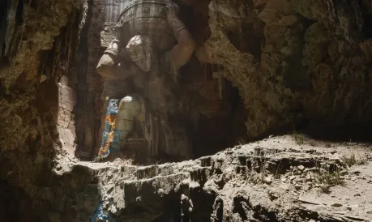

Virtual Shadow Map은 물체의 표면을 여러 구역을 나누어 관리합니다. 아래 그림은 기존에 나눠진 구역들입니다.

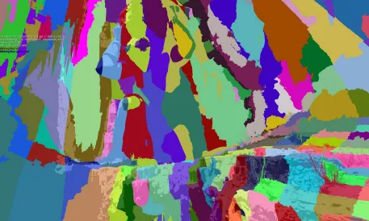

그리고 카메라와의 거리(Depth)에 따라 Shadow Map의 해상도를 결정합니다. 같은 해상도인 구역끼리 묶어 Page라는 것을 구성합니다. 아래 그림은 Page들입니다.

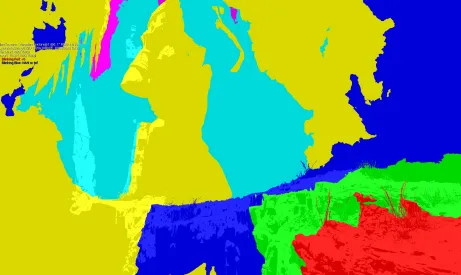

Page는 물체의 전체 표면의 극히 일부분이며, 먼 Page는 낮은 해상도를 가집니다. 아래 그림은 전체 지형에서 Page가 차지하는 부분과 해상도를 나타냈습니다.

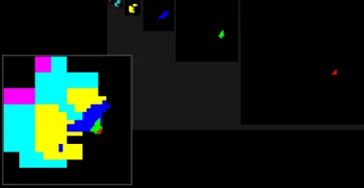

광원 시점에서 Shadow Map에 거리값을 새길 때 Page의 해상도에 따라 Cluster의 크기를 조절해줍니다. Nanite 덕분에 가능하고, Nanite에 유용한 기술인 것입니다. 추가적으로 캐싱도 고려되어 이전 프레임과 똑같은 page는 새로 그리지 않습니다.

---

## 8. Lumen

광원에서 나와 복잡하게 난반사되는 빛을 간접광(Global Illumination)이라고 합니다. 이를 제대로 계산하려면 Ray Tracing을 해야 합니다. 그래서 보통은 Light Map Baking을 통해 광원을 고정하고 Ray Tracing을 미리 계산해 그 효과를 새겨두었습니다. 움직이는 광원의 간접광을 표현할 방법은 실시간 Ray Tracing 말고는 없었습니다.

Lumen은 여러 Global Illumination 기능을 적절히 섞어서 적용하는 기술입니다.

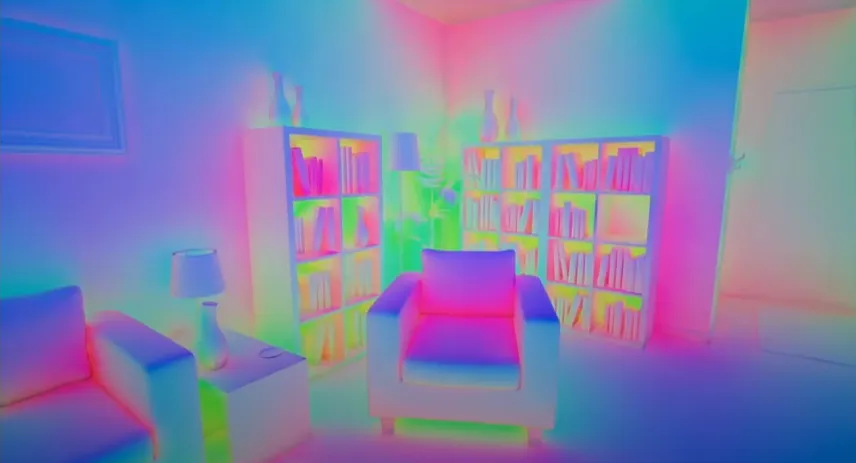

그림에서 빨간색은 Screen Trace, 초록색은 Mesh Distance Field Trace, 파란색은 Global Distance Field Trace입니다.

Screen Trace란, 화면의 Depth Buffer를 이용해 화면 속에서 난반사를 계산하는 작업입니다. 오목한 부분이 똑바로 보일 경우에 잘 작동합니다. 가장 부하가 적은 연산이므로 맨 처음에 작동합니다. 만약 Screen Trace로 충분한 광선이 모이지 않은 경우, 실패 처리가 되며 Mesh Distance Field Trace 과정으로 넘어갑니다.

물체마다 가장 가까운 표면으로의 거리값을 가진 텍스쳐인 Signed Distance Field를 만들어줍니다. Distance Field는 물체에 빛을 쏘는 광원 입장에서 Depth Map 정도로 이해해볼 수 있습니다. 왜냐하면 광선이 물체에 튕겨서 다른 표면에 부딪히는 최소 거리를 의미하기 때문입니다.

각 물체를 감싸는 직육면체의 6개의 면에 투영되는 표면의 모습을 그린 Surface Cache (Card)를 만들어줍니다.

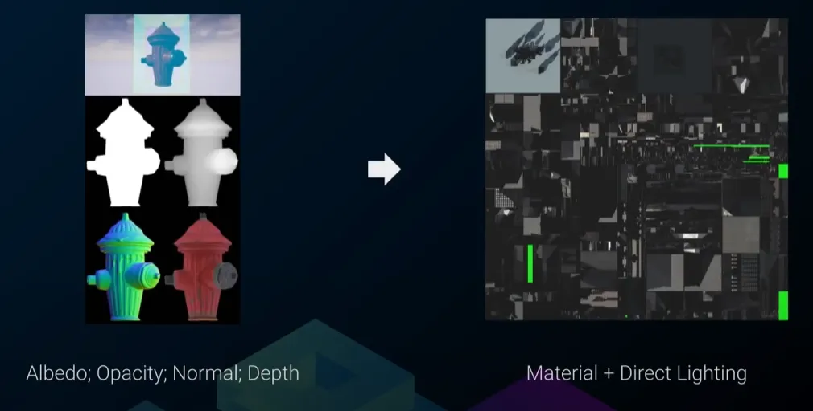

이 때 Nanite로 빠르게 Surface Cache (card)를 만들어줄 수 있습니다. 주의할 점은 건물같이 내부가 있는 물체의 경우, 벽끼리 나눠서 만들어줘야 합니다.

Global Distance Field는 공간의 각 점에서 저해상도로 정의됩니다. 대충 통째로 연산하기 때문에 Mesh Distance Field보다 가볍습니다.

이 Distance Field와 Surface Cache를 통해 빛을 연산하게 됩니다. 이름이 Cache라고 써져있듯이, Surface Cache는 Lighting 연산의 결과를 다시 자기 자신에 반영하여 빛이 여러 번 튕겨 평형에 도달한 상태를 찾아갑니다. 간단하게 두 물체가 있다고 치면, 첫 번째 물체의 표면(Card)에 반사되어 두 번째 물체에 도달한(Distance Field) 빛이 두 번째 물체의 표면(Card)에 반영되는 것입니다.

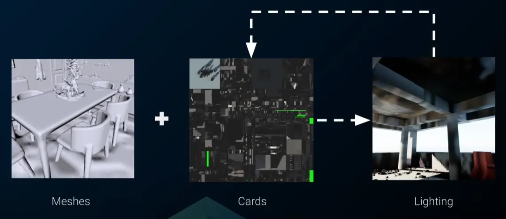

이렇게 Lumen은 아주 효율적인 Ray Tracing을 구현하였다고 볼 수 있겠습니다.

---

## 9. Reference

[https://youtu.be/QzI6xHsFGHA?si=qE_rf3rfRvCZZ-A2](https://youtu.be/QzI6xHsFGHA?si=qE_rf3rfRvCZZ-A2)
[https://youtu.be/eviSykqSUUw?si=h-DaUjHLgd0_ZPqt](https://youtu.be/eviSykqSUUw?si=h-DaUjHLgd0_ZPqt)
[https://youtu.be/laCeIFasZsg?si=4nZa3khQTFSdNWXZ](https://youtu.be/laCeIFasZsg?si=4nZa3khQTFSdNWXZ)
[https://youtu.be/-M1b0gVdP4Y?si=YTAOyhqlB9aOGoOS](https://youtu.be/-M1b0gVdP4Y?si=YTAOyhqlB9aOGoOS)
[https://youtu.be/GWyhed94RxA?si=Ore1ZBjk7SwkF0Tj](https://youtu.be/GWyhed94RxA?si=Ore1ZBjk7SwkF0Tj)