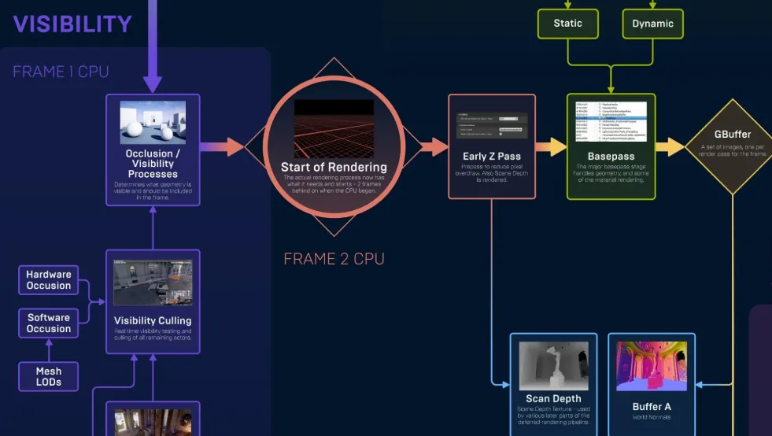
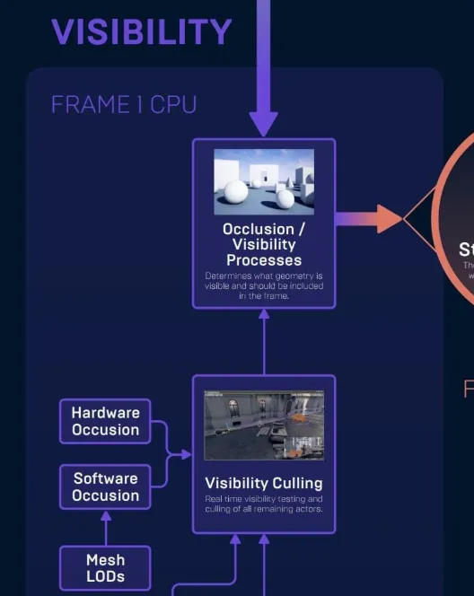
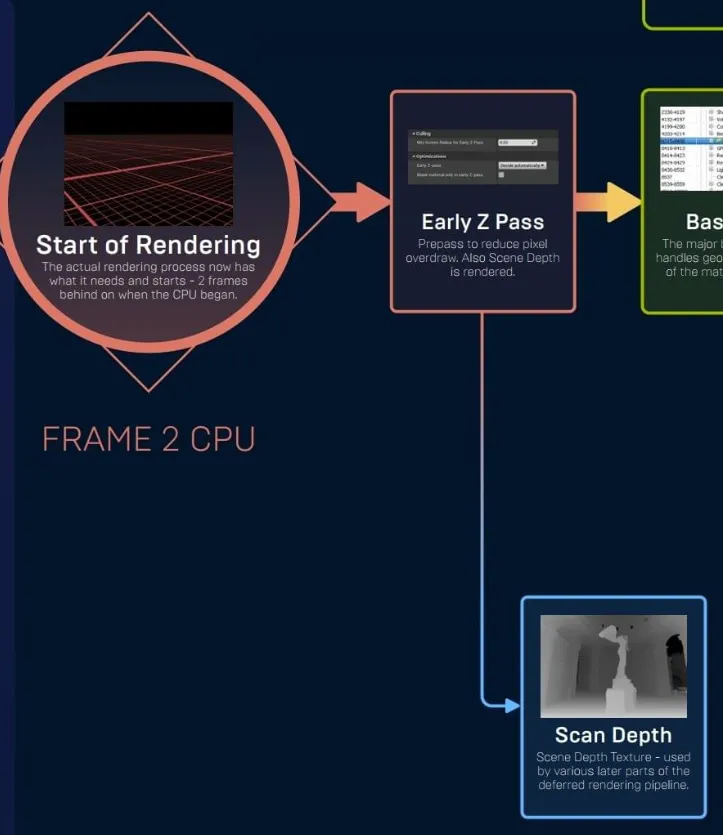
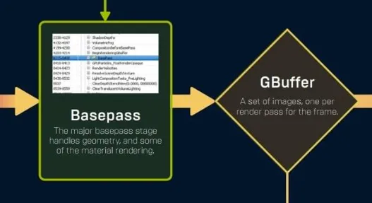
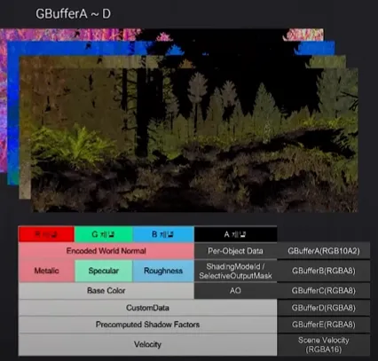
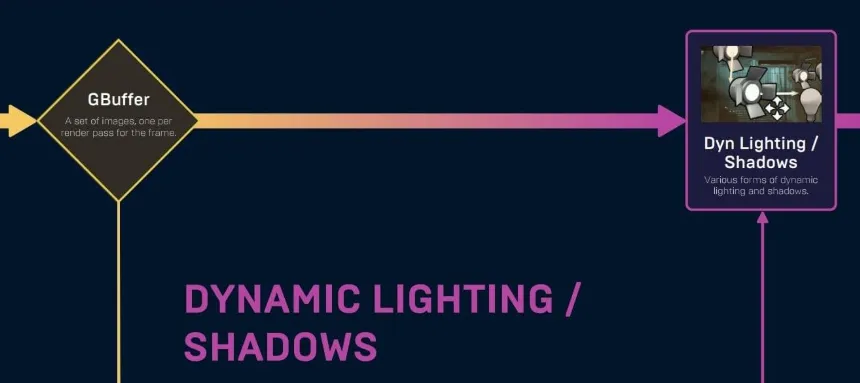

# Unreal Engine 4: Deferred Shader Rendering

안녕하세요.

---

## 1. Forward Rendering

렌더링은 **가상 공간 속 물체**를 카메라 관점의 **픽셀 화면**에 담는 작업입니다. 가상 공간의 보통 **3D 벡터공간**이고, 픽셀 화면은 **2D 비트맵**입니다. 따라서 두 공간을 이어주기 위해서 **Projection**과 **Rasterization**이 사용됩니다.

Projection은 3D를 2D로 바꿔주고, Rasterization은 vertex가 만드는 삼각형에 포함되는 픽셀들을 골라줍니다. 마지막으로 **Shader**가 색을 결정하면 렌더링이 끝납니다.

이 방식은 3D 공간에서 물체마다 Shader 연산을 수행합니다. 따라서 **물체 개수에 비례하는 연산량**을 가집니다. 많은 물체를 다루기 위해, 화면의 **픽셀마다 연산**하는 과정이 고안되었습니다.

---

## 2. Deferred Shader Rendering

Shader 과정을 두 개로 쪼개는 방식이 Deferred (Shader) Rendering입니다. 물체마다 표면 정보(머티리얼)를 가져와 화면에 보이는 표면을 재구성하여 G-Buffer를 만듭니다. 이후에 Shader는 G-Buffer를 받아 Lighting 연산을 수행하게 됩니다.

Unreal Engine 4는 이 방법을 사용합니다.

이 그림을 분석해보겠습니다.

### 2.1 Visibility Culling

맨 처음에 Culling 과정을 수행하게 됩니다.

Culling이란, 물체마다 화면에 보이는지 판단하는 작업을 말합니다. 카메라 뒤에 있거나, 다른 물체에 가린다면 이 과정에서 제외됩니다.

### 2.2 Depth Pre-Pass

렌더링이 시작되며, 화면의 지형인 Depth Map을 가장 먼저 그리게 됩니다.

Depth Prepass란, 픽셀마다 화면에 보이는 물체를 선별하는 작업입니다. 우선 Vertex만 확인하며 카메라와의 최소 거리(Depth)를 기록하는, Depth Map을 만들어줍니다.

이는 사실상 각 픽셀마다 어떤 물체를 그릴지 정해주는 작업과 같습니다. (맨 앞에 있어야 하므로) 마치 물체마다 진행했던 Culling을 픽셀마다 진행하는 것 같습니다. 다음 과정에서 Depth Map을 통해 물체를 판별하게 됩니다.

### 2.3 Base Pass

드디어 G-Buffer를 그리는 과정입니다.

각 픽셀마다 Depth Map으로 물체를 판별해서 표면의 머티리얼 정보를 가져옵니다. 실제로 G-Buffer는 다음과 같이 구성됩니다.

이후에 이 G-Buffer를 가지고 Shader연산(Lighting)을 수행하게 됩니다.

---

## 3. Deferred Material Rendering

하지만 여전히 비효율성이 남아있습니다. Depth Prepass와 Base Pass에서 모두 오브젝트를 참조하기 때문입니다. 즉 Depth Map을 그리면서 Vertex를 다 찾아다녔는데 또 찾아야 한다는 말입니다.

이를 극복하기 위해 Unreal Engine 5에서는 Nanite 전용으로 Deferred Material Rendering 방식을 사용합니다. 자세한 이야기는 다음 글에서 하겠습니다.

---

## 4. 참고문헌

[https://youtu.be/QzI6xHsFGHA?si=CaQjg-RE8CxMBjKC](https://youtu.be/QzI6xHsFGHA?si=CaQjg-RE8CxMBjKC)

---

제목에는 Shader가 들어가지만 정작 Shader는 제가 몰라서 딱히 내용 없습니다..

다음 글에서는 Unreal 5에서 도입한 Nanite, Lumen, Virtual Shadow Map, Mega Lights를 알아보겠습니다.